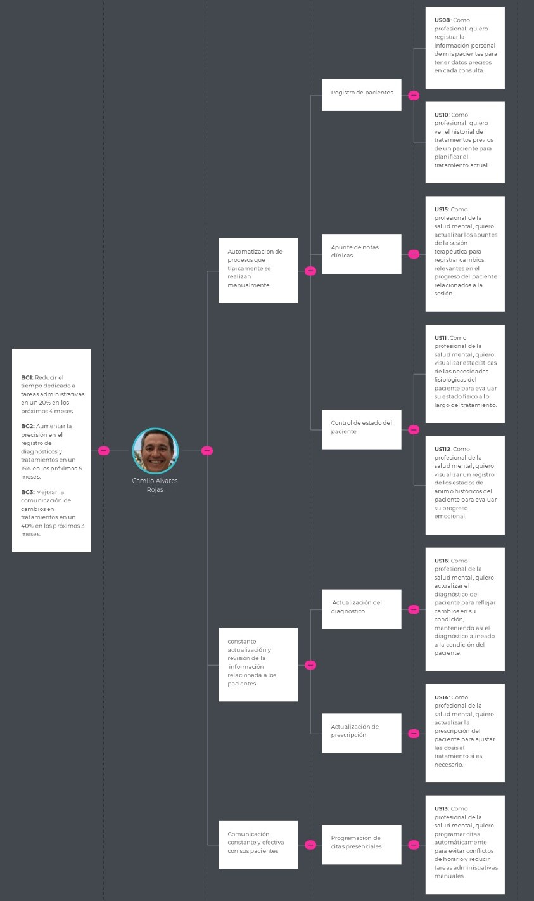
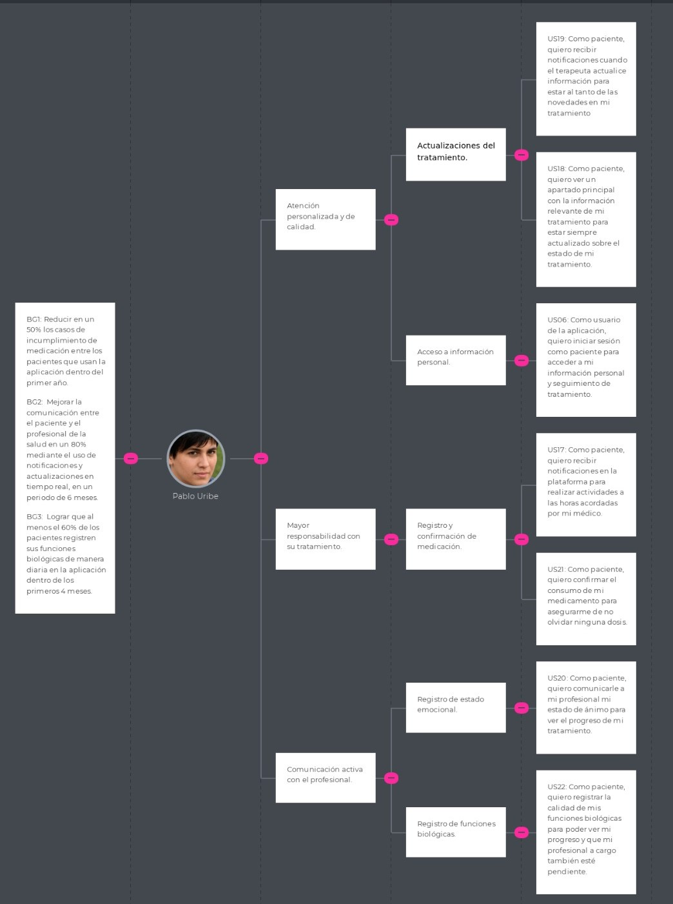
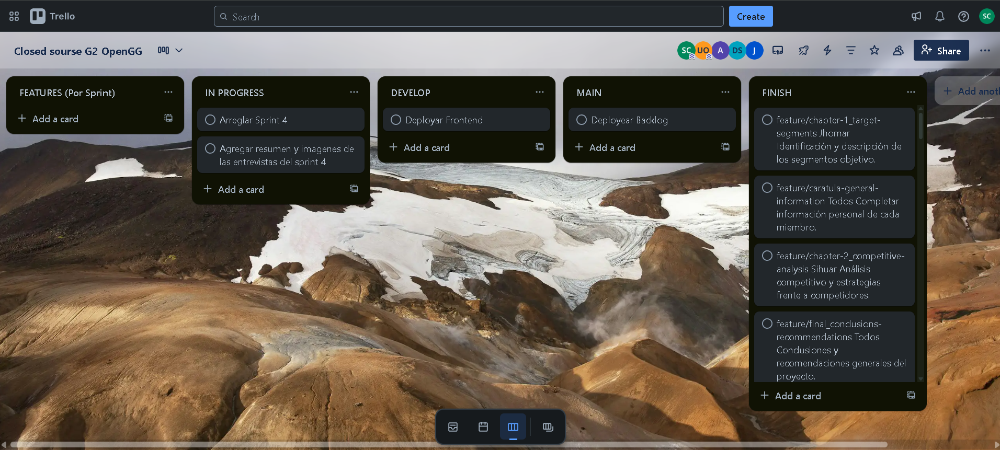

# CAPÍTULO III: Requirements Specifications

## 3.1. To-Be Scenario Mapping.

### Segmento Profecionales de la salud Mental:

### Segmento Pacientes:

## 3.2. User Stories.
### Lista de Épicas

| ID   | Título                                                | Descripción                                                                                                                                                                    | Criterios de aceptación                                                                                                                    | EpicID   |
|------|--------------------------------------------------------|--------------------------------------------------------------------------------------------------------------------------------------------------------------------------------|---------------------------------------------------------------------------------------------------------------------------------------------|----------|
| EP01 | Accesibilidad de la Landing Page                       | Como visitante, quiero que la información sobre la aplicación sea fácil de entender para poder comprender rápidamente su propósito.                           | No corresponde                                                                                                                              | No corresponde |
| EP02 | Interfaz de la Landing Page                            | Como visitante, quiero que la página sea visualmente agradable para que atraiga mi atención.                                                                 | No corresponde                                                                                                                              | No corresponde |
| EP03 | Acceso a la aplicación                                 | Como usuario de la aplicación, quiero acceder con mi información para hacer uso de las características disponibles.                                                             | No corresponde                                                                                                                              | No corresponde |
| EP04 | Registro de información del paciente                   | Como visitante del segmento, quiero registrar información de mis pacientes para manejar su historial clínico y ajustar sus planes de tratamiento de manera efectiva.      | No corresponde                                                                                                                              | No corresponde |
| EP05 | Seguimiento del tratamiento del paciente               | Como visitante del segmento, quiero hacer un seguimiento de mis pacientes para asegurar la eficiencia del tratamiento del paciente.                                       | No corresponde                                                                                                                              | No corresponde |
| EP06 | Registro de actualizaciones del tratamiento            | Como visitante del segmento, quiero hacer actualizaciones a los registros del tratamiento para que el paciente reciba actualizaciones después de cada sesión.              | No corresponde                                                                                                                              | No corresponde |
| EP07 | Recepción de actualizaciones del tratamiento           | Como visitante del segmento, quiero recibir las indicaciones y ajustes de mi tratamiento para estar en constante comunicación con mi profesional de salud mental.                               | No corresponde                                                                                                                              | No corresponde |
| EP08 | Registro de cumplimiento del tratamiento               | Como visitante del segmento quiero registrar mi progreso para que mi terapeuta esté al pendiente de mi estado de salud mental.                                                                | No corresponde                                                                                                                              | No corresponde |
| EP09 | Gestión de información de la cuenta                    | Como usuario quiero gestionar mi información según mis necesidades para mantener siempre información actualizada y precisa.                                                     | No corresponde                                                                                                                              | No corresponde |
| EP10 | Creación y gestión de diagramas técnicos | Como desarrollador, quiero crear y gestionar diagramas técnicos (base de datos, clases, C4) para facilitar el diseño y desarrollo del sistema. | No corresponde | No corresponde |

### Lista de Historias de Usuario

| ID   | Título                                                | Descripción                                                                                                                                                                    | Criterios de aceptación                                                                                                                    | EpicID   |
|------|--------------------------------------------------------|--------------------------------------------------------------------------------------------------------------------------------------------------------------------------------|---------------------------------------------------------------------------------------------------------------------------------------------|----------|
| US01    | Adaptabilidad y compatibilidad de la Landing Page | Como visitante, quiero que el contenido se adapte al tamaño de la pantalla para ver la información ordenada. | **Scenario 1: Adaptabilidad a diferentes tamaños de pantalla**   **Given** el visitante está en la landing page,   **When** entra al sitio,   **Then** el contenido se ajusta al tamaño de la pantalla.   **Scenario 2: Compatibilidad con navegadores principales**   **Given** el visitante está en la landing page,   **When** usa su navegador preferido,   **Then** la landing page es compatible. | EP01 |
| US02    | Encontrar información del propósito de la aplicación | Como visitante, quiero entender rápidamente el propósito de la aplicación. | **Scenario 1: Visibilidad del propósito de la aplicación**   **Given** el visitante está en la landing page,   **When** explora la página,   **Then** la información es clara y concisa.   **Scenario 2: Acceso rápido a los planes de la aplicación**   **Given** el visitante está en la sección de planes,   **When** solicita "Más información",   **Then** la landing lleva a detalles y precios del plan. | EP01 |
| US03    | Visualización de imágenes y gráficos relevantes | Como visitante, quiero ver imágenes y gráficos claros y atractivos. | **Scenario 1: Calidad de las imágenes**   **Given** el visitante está en la landing page,   **When** explora,   **Then** las imágenes son de alta calidad y relevantes.   **Scenario 2: Relevancia de los gráficos**   **Given** el visitante está en la landing page,   **When** se desplaza,   **Then** los gráficos ayudan a entender el contenido. | EP02 |
| US04    | Tipografía cómoda y agradable estéticamente | Como visitante, quiero que la tipografía sea legible y agradable. | **Scenario 1: Legibilidad de la tipografía**   **Given** el visitante está en la landing page,   **When** se desplaza,   **Then** la tipografía es clara y de tamaño adecuado.   **Scenario 2: Consistencia en el estilo tipográfico**   **Given** el visitante está en la landing page,   **When** cambia de sección,   **Then** el estilo tipográfico es consistente. | EP02 |
| US05    | Registro como profesional de la salud mental | Como profesional, quiero registrarme para usar funciones especiales y gestionar pacientes. | **Scenario 1: Registro exitoso**   **Given** el profesional completó el formulario,   **When** presiona "Crear cuenta",   **Then** la cuenta se crea y accede con rol profesional.   **Scenario 2: Registro incompleto**   **Given** el formulario está incompleto,   **When** presiona "Crear cuenta",   **Then** aparece mensaje de error con campos faltantes.   **Scenario 3: Correo ya usado**   **Given** el correo ya está registrado,   **When** presiona "Crear cuenta",   **Then** muestra error y sugiere recuperar contraseña. | EP03 |
| US06    | Inicio de sesión como pacientes | Como paciente, quiero iniciar sesión para ver mi información y tratamiento. | **Scenario 1: Inicio exitoso**   **Given** el paciente ingresó correo y contraseña correctos,   **When** presiona "Iniciar sesión",   **Then** accede a su panel con rol paciente.   **Scenario 2: Contraseña incorrecta**   **Given** la contraseña es incorrecta,   **When** presiona "Iniciar sesión",   **Then** muestra error y opción para restablecer.   **Scenario 3: Recuperación de contraseña**   **Given** olvidó su contraseña,   **When** solicita "Olvidé mi contraseña",   **Then** envía enlace para restablecer. | EP03 |
| US07    | Inicio de sesión como profesional de la salud mental | Como profesional, quiero iniciar sesión para gestionar pacientes y usar herramientas. | **Scenario 1: Inicio exitoso**   **Given** el profesional ingresó correo y contraseña correctos,   **When** presiona "Iniciar sesión",   **Then** accede a su panel con funciones avanzadas y rol profesional.   **Scenario 2: Contraseña incorrecta**   **Given** la contraseña es incorrecta,   **When** presiona "Iniciar sesión",   **Then** muestra error y opción para restablecer.   **Scenario 3: Recuperación de contraseña**   **Given** olvidó su contraseña,   **When** solicita "Olvidé mi contraseña",   **Then** envía enlace para restablecer. | EP03 |
| US08    | Registro de información personal del paciente | Como profesional, quiero registrar los datos del paciente para tener un historial completo. | **Scenario 1: Registro exitoso**   **Given** el profesional completó los datos del paciente,   **When** presiona "Guardar",   **Then** la información se guarda correctamente.   **Scenario 2: Registro incompleto**   **Given** faltan datos,   **When** presiona "Guardar",   **Then** aparece mensaje de error con campos faltantes. | EP04 |
| US09    | Registro de medicamentos del paciente | Como profesional, quiero registrar los medicamentos de mi paciente. | **Scenario 1: Registro exitoso de medicamentos**   **Given** el profesional completó los datos del medicamento,   **When** presiona "Guardar",   **Then** los datos se guardan correctamente.   **Scenario 2: Registro incompleto de medicamentos**   **Given** faltan datos,   **When** presiona "Guardar",   **Then** aparece mensaje de error con campos incompletos. | EP04 |
| US10    | Registro de historial médico del paciente | Como profesional, quiero registrar el historial médico del paciente. | **Scenario 1: Registro exitoso**   **Given** el profesional completó el historial médico,   **When** presiona "Guardar",   **Then** el historial se guarda correctamente. | EP04 |
| US11    | Visualizar datos estadísticos de funciones biológicas | Como profesional, quiero ver estadísticas de la salud física del paciente. | **Scenario 1: Visualización exitosa**   **Given** el profesional accede al perfil del paciente,   **When** visualiza los datos,   **Then** la plataforma muestra las estadísticas correctamente. | EP05 |
| US12    | Visualización de los estados de ánimo del paciente | Como profesional, quiero ver el historial de estados de ánimo del paciente. | **Scenario 1: Visualización de estados de ánimo**   **Given** el profesional accede al perfil del paciente,   **When** ve los estados de ánimo,   **Then** se muestra en formato gráfico o cronológico.   **Scenario 2: No hay estados registrados**   **Given** no hay registros de estados de ánimo,   **When** el profesional intenta ver los estados,   **Then** la plataforma muestra un mensaje indicando que no hay datos registrados. | EP05 |
| US13    | Visualizar información del consumo de medicamentos | Como profesional, quiero ver el cumplimiento del paciente con su medicación. | **Scenario 1: Visualización exitosa**   **Given** el profesional accede al perfil del paciente,   **When** ve el consumo de medicamentos,   **Then** la plataforma muestra el historial de consumo. | EP05 |
| US14    | Actualizar ingesta de pastillas | Como profesional, quiero actualizar la prescripción de medicamentos. | **Scenario 1: Actualización exitosa**   **Given** el profesional actualiza la ingesta de pastillas,   **When** presiona "Guardar",   **Then** la plataforma actualiza la información.   **Scenario 2: Datos incompletos**   **Given** faltan campos,   **When** presiona "Guardar",   **Then** muestra error con campos faltantes. | EP06 |
| US15    | Registro de apuntes por sesión | Como profesional, quiero registrar los apuntes de la sesión. | **Scenario 1: Registro exitoso**   **Given** el profesional escribió el apunte,   **When** presiona "Guardar",   **Then** el apunte se guarda. | EP06 |
| US16    | Actualizar apuntes de la sesión terapéutica | Como profesional, quiero modificar los apuntes de la sesión. | **Scenario 1: Actualización exitosa**   **Given** el profesional edita los apuntes,   **When** presiona "Guardar",   **Then** la plataforma actualiza los apuntes.   **Scenario 2: Error de actualización**   **Given** hay campos incompletos,   **When** presiona "Guardar",   **Then** muestra mensaje de error. | EP06 |
| US17    | Actualizar diagnóstico del paciente | Como profesional, quiero modificar el diagnóstico del paciente. | **Scenario 1: Actualización exitosa**   **Given** el profesional edita el diagnóstico,   **When** presiona "Guardar",   **Then** la plataforma guarda el diagnóstico actualizado. | EP06 |
| US18    | Recibir notificaciones de recordatorios de actividades | Como paciente, quiero recibir notificaciones para mis actividades programadas. | **Scenario 1: Notificación para actividad**   **Given** el paciente aceptó recibir notificaciones,   **When** llega la hora de la actividad,   **Then** recibe una notificación. | EP07 |
| US19    | Visualizar cambios en el dashboard | Como paciente, quiero ver un resumen de mi tratamiento en el dashboard. | **Scenario 1: Visualización del dashboard**   **Given** el paciente accede al dashboard,   **When** entra al tablero principal,   **Then** se muestra la información más relevante del tratamiento. | EP07 |
| US20    | Recibir notificaciones cuando el terapeuta agregue o modifique información | Como paciente, quiero ser notificado cuando el terapeuta actualice información de mi tratamiento. | **Scenario 1: Notificación de actualización**   **Given** el paciente aceptó recibir notificaciones,   **When** el terapeuta guarda cambios en la plataforma,   **Then** el paciente recibe una notificación. | EP07 |
| US21    | Registro de estado de ánimo | Como paciente, quiero registrar mi estado emocional. | **Scenario 1: Registro de estado emocional**   **Given** el paciente está en la sección de estado emocional,   **When** registra su estado,   **Then** se guarda en el perfil del paciente.   **Scenario 2: Visualizar historial de estados**   **Given** el paciente tiene registros previos,   **When** accede al historial,   **Then** la plataforma muestra un calendario de estados emocionales. | EP08 |
| US22    | Confirmación de consumo de pastillas | Como paciente, quiero confirmar que tomé mi medicación. | **Scenario 1: Confirmación de consumo**   **Given** el paciente accede a la sección de medicamentos,   **When** confirma la ingesta,   **Then** la plataforma guarda el registro de consumo.   **Scenario 2: Verificación de consumo**   **Given** el paciente tiene registros de consumo,   **When** accede al historial,   **Then** la plataforma muestra un calendario con los días confirmados. | EP08 |
| US23    | Registro de funciones biológicas | Como paciente, quiero registrar mis funciones biológicas. | **Scenario 1: Registro de funciones biológicas**   **Given** el paciente está en la sección de funciones biológicas,   **When** ingresa los datos de sueño, hambre, energía e hidratación,   **Then** la plataforma guarda la información. | EP08 |
| US24    | Cambio de datos de acceso del paciente | Como profesional, quiero actualizar los datos de acceso del paciente. | **Scenario 1: Actualización exitosa**   **Given** el profesional actualiza los datos de acceso,   **When** presiona "Guardar",   **Then** la plataforma actualiza los datos y muestra confirmación.   **Scenario 2: Error por falta de datos**   **Given** faltan campos obligatorios,   **When** presiona "Guardar",   **Then** muestra mensaje de error. | EP09 |
| US25    | Cambio de información personal del profesional de salud mental | Como profesional, quiero actualizar mi información personal. | **Scenario 1: Actualización exitosa**   **Given** el profesional actualiza los datos personales,   **When** presiona "Guardar",   **Then** la plataforma actualiza los datos y muestra confirmación.   **Scenario 2: Error por falta de datos**   **Given** faltan campos obligatorios,   **When** presiona "Guardar",   **Then** muestra mensaje de error. | EP09 |
| US26 | Creación de diagramas técnicos | Como desarrollador, quiero crear los diagramas técnicos del sistema para facilitar su desarrollo. | **Scenario 1: Diagrama de base de datos**   **Given** el desarrollador tiene claro el modelo de datos,   **When** construye el diagrama ER,   **Then** debe reflejar correctamente tablas, relaciones y atributos.   **Scenario 2: Diagrama de clases**   **Given** se ha definido la lógica del sistema,   **When** se crea el diagrama de clases,   **Then** deben mostrarse clases, atributos y relaciones. | EP10 |

### Lista de Tecnical Stories
| ID   | Título                                                | Descripción                                                                                                                                                                    | Criterios de aceptación                                                                                                                    | EpicID   |
|------|--------------------------------------------------------|--------------------------------------------------------------------------------------------------------------------------------------------------------------------------------|---------------------------------------------------------------------------------------------------------------------------------------------|----------|
| TS01 | Añadir paciente a través de un RESTful API                            | Como desarrollador, quiero que se pueda añadir a un paciente a través de un API, para que el profesional de salud mental registre al paciente.                                                                                                  | **Scenario 1**: Añadir paciente con DNI único   **Given** el endpoint “/api/v1/patients” está disponible,   **When** un POST request es enviado con los valores de nombre, apellido, correo, dni, fecha de nacimiento, nombre de usuario y contraseña,   **Then** se recibe un response con un status 201 y el recurso del paciente es incluido en el Body del response con un nuevo id y los valores registrados de su usuario, nombre y correo.    **Scenario 2**: Añadir paciente con DNI repetido   **Given** el endpoint “/api/v1/patients” está disponible,   **When** un POST request es enviado con los valores de nombre, apellido, correo, dni, fecha de nacimiento, nombre de usuario y contraseña,   **And** un recurso de paciente tiene el mismo valor de dni que el que viene en el request,   **Then** se recibe un response con un status 400 y un mensaje en el body del response, con un mensaje que diga: “Ya existe un paciente registrado con el mismo DNI”. | No corresponde |
| TS02 | Añadir profesional de la salud mental a través de un RESTful API      | Como desarrollador, quiero implementar la opción de añadir un profesional de la salud mental a través de una API RESTful, para que este pueda interactuar con los pacientes en el sistema.                                                      | **Scenario 1**: Añadir profesional con DNI único   **Given** el endpoint “/api/v1/profesionales” está disponible,   **When** un POST request es enviado con los valores de nombre, apellido, correo, dni, especialidad, nombre de usuario y contraseña,   **Then** se recibe un response con un status 201 y el recurso del profesional es incluido en el body del response con un nuevo id y los valores registrados de su nombre, apellido y especialidad.    **Scenario 2**: Añadir profesional con DNI repetido   **Given** el endpoint “/api/v1/profesionales” está disponible,   **When** un POST request es enviado con los valores de nombre, apellido, correo, dni, especialidad, nombre de usuario y contraseña,   **And** un recurso de profesional tiene el mismo valor de dni que el que viene en el request,   **Then** se recibe un response con un status 400 y un mensaje en el body del response, con un mensaje que diga: “Ya existe un profesional registrado con el mismo DNI”. | No corresponde |
| TS03 | Eliminar paciente a través de un RESTful API                          | Como desarrollador, quiero implementar la funcionalidad para eliminar un paciente a través de una API RESTful, para gestionar correctamente la eliminación de registros de pacientes según sea necesario.                                         | **Scenario 1**: Eliminar paciente existente   **Given** el endpoint “/api/v1/pacientes/{id}” está disponible,   **And** existe un paciente con el id especificado,   **When** un DELETE request es enviado al endpoint con el id del paciente,   **Then** se recibe un response con un status 204 y el recurso del paciente es eliminado del sistema.    **Scenario 2**: Intentar eliminar paciente inexistente   **Given** el endpoint “/api/v1/pacientes/{id}” está disponible,   **And** no existe un paciente con el id especificado,   **When** un DELETE request es enviado al endpoint con el id del paciente,   **Then** se recibe un response con un status 404 y un mensaje en el body del response que diga: “Paciente no encontrado”. | No corresponde |
| TS04 | Eliminar profesional de la salud mental a través de un RESTful API    | Como desarrollador, quiero implementar la funcionalidad para eliminar un profesional de la salud mental a través de una API RESTful, de manera que el sistema pueda gestionar correctamente la eliminación de registros de profesionales según sea necesario. | **Scenario 1**: Eliminar profesional existente   **Given** el endpoint “/api/v1/profesionales/{id}” está disponible,   **And** existe un profesional con el id especificado,   **When** un DELETE request es enviado al endpoint con el id del profesional,   **Then** se recibe un response con un status 204 y el recurso del profesional es eliminado del sistema.    **Scenario 2**: Intentar eliminar profesional inexistente   **Given** el endpoint “/api/v1/profesionales/{id}” está disponible,   **And** no existe un profesional con el id especificado,   **When** un DELETE request es enviado al endpoint con el id del profesional,   **Then** se recibe un response con un status 404 y un mensaje en el body del response que diga: “Profesional no encontrado”. | No corresponde |
| TS05 | Inicio de sesión a través de un RESTful API                           | Como desarrollador, quiero implementar la característica de inicio de sesión a través de una API RESTful, para que los usuarios puedan autenticarse y acceder a las funcionalidades del sistema de manera segura.                                 | **Scenario 1**: Inicio de sesión exitoso   **Given** el endpoint “/api/v1/login” está disponible,   **When** un POST request es enviado con los valores de nombre de usuario y contraseña correctos,   **Then** se recibe un response con un status 200 y un token JWT es incluido en el body del response para futuras autenticaciones.    **Scenario 2**: Inicio de sesión fallido por credenciales incorrectas   **Given** el endpoint “/api/v1/login” está disponible,   **When** un POST request es enviado con valores de nombre de usuario o contraseña incorrectos,   **Then** se recibe un response con un status 401 y un mensaje en el body del response que diga: “Credenciales incorrectas”. | No corresponde |
| TS06 | Añadir historial médico del paciente a través de un RESTful API         | Como desarrollador, quiero implementar la opción para añadir un historial previo del paciente a través de una API RESTful, para que el sistema pueda almacenar y gestionar la información clínica anterior del paciente para su consulta y análisis posterior. | **Scenario 1**: Añadir historial previo con datos válidos   **Given** el endpoint “/api/v1/medical-records” está disponible,   **When** un POST request es enviado con los valores de id del paciente, fecha, diagnóstico, tratamiento, y observaciones,   **Then** se recibe un response con un status 201 y el recurso del historial es incluido en el body del response con un nuevo id y los valores registrados.    **Scenario 2**: Intentar añadir historial con datos faltantes   **Given** el endpoint “/api/v1/historiales” está disponible,   **When** un POST request es enviado con alguno de los valores requeridos (id del paciente, fecha, diagnóstico) faltante,   **Then** se recibe un response con un status 400 y un mensaje en el body del response que diga: “Faltan datos requeridos para el historial del paciente”. | No corresponde |
| TS07 | Añadir medicamentos de un paciente a través de un RESTful API           | Como desarrollador, quiero implementar la opción para añadir medicamentos prescritos a un paciente a través de una API RESTful, de manera que la medicación del paciente quede registrada y pueda ser consultada y actualizada según sea necesario. | **Scenario 1**: Añadir medicamentos con datos válidos   **Given** el endpoint “/api/v1/medicines” está disponible,   **When** un POST request es enviado con los valores de id del paciente, nombre del medicamento, dosis, frecuencia, y duración del tratamiento,   **Then** se recibe un response con un status 201 y el recurso del medicamento es incluido en el body del response con un nuevo id y los valores registrados.    **Scenario 2**: Intentar añadir medicamento con datos faltantes   **Given** el endpoint “/api/v1/medicamentos” está disponible,   **When** un POST request es enviado con alguno de los valores requeridos (nombre del medicamento, dosis, frecuencia) faltante,   **Then** se recibe un response con un status 400 y un mensaje en el body del response que diga: “Faltan datos requeridos para registrar el medicamento”. | No corresponde |
| TS08 | Recuperar datos estadísticos de funciones biológicas del paciente       | Como desarrollador, quiero implementar la opción de recuperar datos estadísticos de funciones biológicas del paciente a través de una API RESTful, de manera que esta información pueda ser almacenada y analizada para el monitoreo de la salud del paciente. | **Scenario 1**: Recuperar datos estadísticos válidos   **Given** el endpoint “/api/v1/estadisticas/biologicas/{id}” está disponible,   **When** un GET request es enviado con los valores de id del paciente,   **Then** se recibe un response con un status 200.    **Scenario 2**: Intentar recuperar datos estadísticos con id inexistente   **Given** el endpoint “/api/v1/statistics/biologic/{id}” está disponible,   **When** un GET request es enviado y el id enviado en la petición no existe,   **Then** se recibe un response con un status 400 y un mensaje en el body del response que diga: “El id no existe”. | No corresponde |
| TS09 | Recuperar datos del estado de ánimo del paciente a través de un API     | Como desarrollador, quiero implementar la opción para recuperar datos del estado de ánimo del paciente a través de una API RESTful, de manera que esta información pueda ser utilizada para el seguimiento y tratamiento del paciente.                | **Scenario 1**: Recuperar datos del estado de ánimo válidos   **Given** el endpoint “/api/v1/statistics/mood/:id” está disponible,   **When** un GET request es enviado con los valores de id del paciente y fecha,   **Then** se recibe un response con un status 200 y los datos del estado de ánimo son recuperados y un resumen se incluye en el body del response.    **Scenario 2**: Intentar recuperar datos del estado de ánimo de un usuario inexistente   **Given** el endpoint “/api/v1/statistics/mood” está disponible,   **When** un GET request es enviado con el valor del id que no existe,   **Then** se recibe un response con un status 400 y un mensaje en el body del response que diga: “El id del usuario no existe”. | No corresponde |
| TS10 | Recuperar datos de consumo de medicamentos válidos                     | Como desarrollador, quiero implementar la opción de recuperar datos del consumo de medicamentos del paciente a través de una API RESTful, de manera que se pueda hacer seguimiento al cumplimiento del tratamiento por parte del paciente.             | **Scenario 1**: Recuperar datos de consumo de medicamentos válidos   **Given** el endpoint “/api/v1/consumption/medication” está disponible,   **When** un GET request es enviado con los valores de id del paciente y fecha,   **Then** se recibe un response con un status 200 y los datos del consumo de medicamentos son recuperados y un resumen se incluye en el body del response.    **Scenario 2**: Intentar recuperar datos de consumo de medicamentos con id de paciente incorrecto   **Given** el endpoint “/api/v1/consumption/medication” está disponible,   **When** un GET request es enviado con el valor del id del paciente erróneo,   **Then** se recibe un response con un status 400 y un mensaje en el body del response que diga: “El paciente no existe”. | No corresponde |
| TS11 | Actualizar información de consumo de pastillas del paciente a través de un RESTful API | Como desarrollador, quiero implementar la opción de actualizar la información de consumo de pastillas del paciente a través de una API RESTful, de manera que se pueda corregir o actualizar los registros de consumo en caso de errores o cambios en el tratamiento. | **Scenario 1**: Actualizar información de consumo de pastillas existente   **Given** el endpoint “/api/v1/consumo/medicamentos/{id}” está disponible,   **When** un PUT request es enviado con los valores de dosis tomada y fecha y hora actualizados,   **Then** se recibe un response con un status 200 y los datos de consumo son actualizados en el sistema y el recurso actualizado se incluye en el body del response.    **Scenario 2**: Intentar actualizar información de consumo con id inexistente   **Given** el endpoint “/api/v1/consumo/medicamentos/{id}” está disponible,   **And** no existe un registro de consumo con el id especificado,   **When** un PUT request es enviado al endpoint con el id del registro de consumo,   **Then** se recibe un response con un status 404 y un mensaje en el body del response que diga: “Registro de consumo no encontrado”. | No corresponde |
| TS12 | Actualizar apuntes de la sesión terapéutica a través de un RESTful API  | Como desarrollador, quiero implementar la opción de actualizar los apuntes de una sesión terapéutica a través de una API RESTful, de manera que el profesional de salud mental pueda mantener los registros de la sesión actualizados.            | **Scenario 1**: Actualizar apuntes de sesión existente   **Given** el endpoint “/api/v1/sesiones/{id}/apuntes” está disponible,   **When** un PUT request es enviado con los valores de id de la sesión y los nuevos apuntes,   **Then** se recibe un response con un status 200 y los apuntes de la sesión son actualizados en el sistema y el recurso actualizado se incluye en el body del response.    **Scenario 2**: Intentar actualizar apuntes con id de sesión inexistente   **Given** el endpoint “/api/v1/sesiones/{id}/apuntes” está disponible,   **And** no existe una sesión con el id especificado,   **When** un PUT request es enviado al endpoint con el id de la sesión,   **Then** se recibe un response con un status 404 y un mensaje en el body del response que diga: “Sesión no encontrada”. | No corresponde |
| TS13 | Añadir apuntes de la sesión terapéutica a través de un RESTful API      | Como desarrollador, quiero implementar la funcionalidad para añadir apuntes de una sesión terapéutica a través de una API RESTful, de manera que el profesional de salud mental pueda registrar información relevante sobre la sesión y el progreso del paciente. | **Scenario 1**: Añadir apuntes con datos válidos   **Given** el endpoint “/api/v1/sessions/{id}/notes” está disponible,   **When** un POST request es enviado con los valores de id de la sesión y los nuevos apuntes,   **Then** se recibe un response con un status 201 y los apuntes de la sesión son almacenados en el sistema y el recurso creado se incluye en el body del response.    **Scenario 2**: Intentar añadir apuntes a una sesión inexistente   **Given** el endpoint “/api/v1/sessions/{id}/notes” está disponible,   **And** no existe una sesión con el id especificado,   **When** un POST request es enviado al endpoint con el id de la sesión,   **Then** se recibe un response con un status 404 y un mensaje en el body del response que diga: “Sesión no encontrada”. | No corresponde |
| TS14 | Actualizar diagnóstico del paciente a través de un RESTful API          | Como desarrollador, quiero implementar la opción de actualizar el diagnóstico del paciente a través de una API RESTful, de manera que el profesional de salud mental pueda modificar y mantener actualizado el diagnóstico del paciente en el sistema. | **Scenario 1**: Actualizar diagnóstico existente   **Given** el endpoint “/api/v1/diagnostics/{id}” está disponible,   **When** un PUT request es enviado con los valores de id del diagnóstico y la nueva información del diagnóstico,   **Then** se recibe un response con un status 200 y el diagnóstico del paciente es actualizado en el sistema y el recurso actualizado se incluye en el body del response.    **Scenario 2**: Intentar actualizar diagnóstico con id inexistente   **Given** el endpoint “/api/v1/diagnostics/{id}” está disponible,   **And** no existe un diagnóstico con el id especificado,   **When** un PUT request es enviado al endpoint con el id del diagnóstico,   **Then** se recibe un response con un status 404 y un mensaje en el body del response que diga: “Diagnóstico no encontrado”. | No corresponde |
| TS15 | Crear diagnóstico del paciente a través de un RESTful API               | Como desarrollador, quiero implementar la opción de crear un nuevo diagnóstico del paciente a través de una API RESTful, de manera que el profesional de salud mental pueda registrar un diagnóstico inicial para el paciente en el sistema.        | **Scenario 1**: Crear diagnóstico con datos válidos   **Given** el endpoint “/api/v1/diagnostics” está disponible,   **When** un POST request es enviado con los valores de id del paciente, fecha, y detalles del diagnóstico,   **Then** se recibe un response con un status 201 y el diagnóstico es almacenado en el sistema y el recurso creado se incluye en el body del response.    **Scenario 2**: Intentar crear diagnóstico con datos faltantes   **Given** el endpoint “/api/v1/diagnosticos” está disponible,   **When** un POST request es enviado sin alguno de los valores requeridos (como id del paciente o detalles del diagnóstico),   **Then** se recibe un response con un status 400 y un mensaje en el body del response que diga: “Faltan datos requeridos para el diagnóstico”. | No corresponde |
| TS16 | Obtener recordatorio de actividades a través de un RESTful API          | Como desarrollador, quiero implementar la opción para obtener el recordatorio de actividades a través de una API RESTful, de manera que los pacientes puedan visualizar sus próximos compromisos o tareas asignadas.                            | **Scenario 1**: Obtener recordatorio de actividades válido   **Given** el endpoint “/api/v1/reminders/:id” está disponible,   **When** un GET request es enviado con los valores de id del paciente,   **Then** se recibe un response con un status 200 y el recordatorio de actividades es recuperado en el body del response, con los detalles del recordatorio.    **Scenario 2**: Intentar obtener recordatorio para un paciente inexistente   **Given** el endpoint “/api/v1/reminders/:id” está disponible,   **And** no existe un paciente con el id especificado,   **When** un GET request es enviado con el id del paciente,   **Then** se recibe un response con un status 404 y un mensaje en el body del response que diga: “Paciente no encontrado”. | No corresponde |
| TS17 | Obtener datos del dashboard a través de un RESTful API                  | Como desarrollador, quiero implementar la opción de obtener los datos del dashboard del paciente a través de una API RESTful, de manera que se pueda visualizar información resumida y relevante para el seguimiento de su estado de salud y progreso. | **Scenario 1**: Obtener datos del dashboard válidos   **Given** el endpoint “/api/v1/dashboard” está disponible,   **When** un GET request es enviado con el id del paciente,   **Then** se recibe un response con un status 200 y los datos del dashboard son recuperados en el body del response, mostrando información relevante del estado de salud del paciente.    **Scenario 2**: Intentar obtener datos del dashboard para un paciente inexistente   **Given** el endpoint “/api/v1/dashboard” está disponible,   **And** no existe un paciente con el id especificado,   **When** un GET request es enviado con el id del paciente,   **Then** se recibe un response con un status 404 y un mensaje en el body del response que diga: “Paciente no encontrado”. | No corresponde |
| TS18 | Obtener notificación cuando el terapeuta agregue o modifique información | Como desarrollador, quiero implementar la opción de obtener notificaciones cuando el terapeuta agregue o modifique información a través de una API RESTful, para que el paciente o los sistemas conectados puedan estar al tanto de actualizaciones importantes. | **Scenario 1**: Obtener notificación de actualización de información   **Given** el endpoint “/api/v1/notifications” está disponible,   **When** un GET request es enviado con el id del paciente,   **Then** se recibe un response con un status 200 y la notificación de la modificación o adición de información es recuperada en el body del response, mostrando el detalle de la actualización.    **Scenario 2**: Intentar obtener notificación para un paciente inexistente   **Given** el endpoint “/api/v1/notifications” está disponible,   **And** no existe un paciente con el id especificado,   **When** un GET request es enviado con el id del paciente,   **Then** se recibe un response con un status 404 y un mensaje en el body del response que diga: “Paciente no encontrado”. | No corresponde |
| TS19 | Registro de estado de ánimo del paciente a través de un RESTful API     | Como desarrollador, quiero implementar la opción de registrar el estado de ánimo del paciente a través de una API RESTful, para que la información del estado emocional del paciente sea almacenada y esté disponible para su análisis y seguimiento. | **Scenario 1**: Registrar estado de ánimo con datos válidos   **Given** el endpoint “/api/v1/patient/:id/mood” está disponible,   **When** un POST request es enviado con los valores de id del paciente, fecha, y nivel de estado de ánimo (por ejemplo, escala de 1 a 10),   **Then** se recibe un response con un status 201 y el estado de ánimo es registrado en el sistema y el recurso creado se incluye en el body del response.    **Scenario 2**: Intentar registrar estado de ánimo sin nivel de estado de ánimo   **Given** el endpoint “/api/v1/patient/:id/mood” está disponible,   **When** un POST request es enviado sin el valor de nivel de estado de ánimo,   **Then** se recibe un response con un status 400 y un mensaje en el body del response que diga: “Mood level is a required field”. | No corresponde |
| TS20 | Registro de confirmación de consumo de pastillas a través de un RESTful API | Como desarrollador, quiero implementar la opción de registrar la confirmación del consumo de pastillas a través de una API RESTful, de manera que se pueda hacer un seguimiento del cumplimiento del tratamiento por parte del paciente.            | **Scenario 1**: Registrar confirmación de consumo con datos válidos   **Given** el endpoint “/api/v1/patient/:id/pill-consumption” está disponible,   **When** un POST request es enviado con los valores de id del paciente, nombre del medicamento, dosis tomada, fecha y hora,   **Then** se recibe un response con un status 201 y la confirmación de consumo es registrada en el sistema y el recurso creado se incluye en el body del response.    **Scenario 2**: Intentar registrar confirmación de consumo sin dosis tomada   **Given** el endpoint “/api/v1/patient/:id/pill-consumption” está disponible,   **When** un POST request es enviado sin el valor de dosis tomada,   **Then** se recibe un response con un status 400 y un mensaje en el body del response que diga: “Pill dosage is a required field”. | No corresponde |
| TS21 | Registro de funciones biológicas a través de un RESTful API             | Como desarrollador, quiero implementar la opción de registrar las funciones biológicas del paciente a través de una API RESTful, de manera que estos datos puedan ser almacenados para monitoreo y análisis clínico.                              | **Scenario 1**: Registrar funciones biológicas con datos válidos   **Given** el endpoint “/api/v1/patient/:id/biological-functions” está disponible,   **When** un POST request es enviado con los valores de id del paciente, frecuencia cardíaca, presión arterial, y temperatura,   **Then** se recibe un response con un status 201 y las funciones biológicas son registradas en el sistema y el recurso creado se incluye en el body del response.    **Scenario 2**: Intentar registrar funciones biológicas con datos faltantes   **Given** el endpoint “/api/v1/patients/:id/biological-functions” está disponible,   **When** un POST request es enviado sin alguno de los valores requeridos (frecuencia cardíaca, presión arterial o temperatura),   **Then** se recibe un response con un status 400 y un mensaje en el body del response que diga: “Required biological function data is missing”. | No corresponde |
| TS22 | Actualización de datos de acceso de un paciente a través de un RESTful API | Como desarrollador, quiero implementar la opción de actualizar los datos de acceso de un paciente a través de una API RESTful, de manera que el paciente pueda modificar sus credenciales para mejorar la seguridad.                               | **Scenario 1**: Actualizar datos de acceso con credenciales válidas   **Given** el endpoint “/api/v1/patient-account/:id” está disponible,   **When** un PUT request es enviado con los valores de id del paciente, nombre de usuario, contraseña actual, y nueva contraseña,   **Then** se recibe un response con un status 200 y los datos de acceso del paciente son actualizados en el sistema y el recurso actualizado se incluye en el body del response.    **Scenario 2**: Intentar actualizar datos de acceso con nombre de usuario ya existente   **Given** el endpoint “/api/v1/patient-account/:id” está disponible,   **When** un PUT request es enviado con un nuevo username que ya existe,   **Then** se recibe un response con un status 400 y un mensaje en el body del response que diga: “Username already exists”. | No corresponde |
| TS23 | Actualización de información del profesional de salud mental a través de un RESTful API | Como desarrollador, quiero implementar la opción de actualizar la información del profesional de salud mental a través de una API RESTful, de manera que los datos del profesional (como la especialidad o los datos de contacto) puedan mantenerse actualizados en el sistema. | **Scenario 1**: Actualizar información profesional con datos válidos   **Given** el endpoint “/api/v1/mental-health-professional/:id” está disponible,   **When** un PUT request es enviado con los valores de id del profesional, nombre, especialidad, dirección, número de teléfono y correo electrónico,   **Then** se recibe un response con un status 200 y la información del profesional de salud mental es actualizada en el sistema y el recurso actualizado se incluye en el body del response.    **Scenario 2**: Intentar actualizar información profesional sin datos completos   **Given** el endpoint “/api/v1/mental-health-professional/:id” está disponible,   **When** un PUT request es enviado sin algún valor requerido (como especialidad o número de teléfono),   **Then** se recibe un response con un status 400 y un mensaje en el body del response que diga: “Required professional information is missing”. | No corresponde |
| TS24 | Registro de sesión terapéutica a través de un RESTful API | Como desarrollador, quiero implementar la opción para registrar una sesión terapéutica a través de una API RESTful, permitiendo a los profesionales de salud mental almacenar detalles de sus sesiones con los pacientes. | **Scenario 1**: Registrar sesión con datos válidos   **Given** el endpoint “/api/v1/sessions” está disponible,   **When** un POST request es enviado con los valores de id del paciente, id del profesional, fecha, hora y duración de la sesión,   **Then** se recibe un response con un status 201   **And** el recurso de la sesión es incluido en el body del response con un nuevo id y los valores registrados de id del paciente, id del profesional, fecha, hora y duración de la sesión.    **Scenario 2**: Intentar registrar sesión con datos faltantes   **Given** el endpoint “/api/v1/sessions” está disponible,   **When** un POST request es enviado sin alguno de los valores requeridos (id del paciente, id del profesional, fecha o hora),   **Then** se recibe un response con un status 400   **And** un mensaje en el body del response que diga: “Faltan datos requeridos para la creación de la sesión”. | No corresponde |
| TS25 | Obtener sesión terapéutica a través de un RESTful API | Como desarrollador, quiero implementar la opción para obtener la información de una sesión terapéutica a través de una API RESTful, permitiendo a los profesionales de salud mental y al sistema acceder a los detalles de las sesiones de un paciente. | **Scenario 1**: Obtener sesión existente   **Given** el endpoint “/api/v1/sessions/{id}” está disponible   **And** existe una sesión con el id especificado,   **When** un GET request es enviado al endpoint con el id de la sesión,   **Then** se recibe un response con un status 200   **And** los detalles de la sesión (id del paciente, id del profesional, fecha, hora, y duración) se incluyen en el body del response.    **Scenario 2**: Intentar obtener sesión inexistente   **Given** el endpoint “/api/v1/sessions/{id}” está disponible   **And** no existe una sesión con el id especificado   **When** un GET request es enviado al endpoint con el id de la sesión   **Then** se recibe un response con un status 404   **And** un mensaje en el body del response que diga: “Sesión no encontrada”. | No corresponde |
| TS26 | Creación de diagramas técnicos | Como desarrollador, quiero crear los diagramas técnicos del sistema para facilitar su desarrollo. | **Scenario 1**: Diagrama de base de datos   **Given** el desarrollador tiene claro el modelo de datos,   **When** construye el diagrama ER,   **Then** debe reflejar correctamente tablas, relaciones y atributos.    **Scenario 2**: Diagrama de clases   **Given** se ha definido la lógica del sistema,   **When** se crea el diagrama de clases,   **Then** deben mostrarse clases, atributos y relaciones. | No corresponde |

## 3.3. Impact Mapping

**Impact mapping del segmento objetivo: profesional de salud mental**

  

**Impact mapping del segmento objetivo: Pacientes**

  

## 3.4. Product Backlog

| Orden | User Story / Technical Story Id | Título                                                                                              | Descripción                                                                                                                                                                                                                                                                              | Story Points (1 / 2 / 3 / 5 / 8)   |
|-------|--------------------------------------------------------|--------------------------------------------------------------------------------------------------------------------------------------------------------------------------------|---------------------------------------------------------------------------------------------------------------------------------------------|----------|
| 1     | US03                            | Presentación visual de imágenes y gráficos relevantes                                               | **Como** usuario que visita la Landing Page, **deseo** que las imágenes y gráficos sean nítidos y visualmente atractivos **para** captar mi atención y entender mejor el contenido.                                                                                                      | 1                                  |
| 2     | US04                            | Tipografía clara y agradable a la vista                                                             | **Como** usuario que visita la Landing Page, **deseo** que la tipografía de la página sea fácil de leer y visualmente agradable **para** hacer más cómoda la lectura y navegación.                                                                                                       | 1                                  |
| 3     | US03                            | Acceso a Soporte Técnico                                                                            | **Como** visitante de la Landing Page, **quiero** tener fácil acceso a soporte técnico **para** resolver cualquier duda o problema relacionado con la aplicación.                                                                                                                        | 3                                  |
| 4     | US06                            | Diseño Atractivo                                                                                    | **Como** visitante de la Landing Page, **quiero** que el diseño de la página sea moderno y atractivo **para** que me invite a explorar más sobre la aplicación.                                                                                                                          | 5                                  |
| 5     | US07                            | Interactividad en la Navegación                                                                     | **Como** visitante de la Landing Page, **quiero** que la navegación sea interactiva y fluida **para** tener una experiencia de usuario positiva mientras exploro la aplicación.                                                                                                          | 5                                  |
| 6     | US01                            | Adaptabilidad y compatibilidad de la Landing Page    
| 7     | US02                            | Localizar información sobre el propósito de la aplicación                                           | **Como** usuario que visita la Landing Page, **deseo** encontrar de manera sencilla la información que explique la finalidad de la aplicación **para** entender cómo puede beneficiarme.                                                                                                 | 2                                  |
| 8     | US20                            | Registro de emociones o estado de ánimo                                                             | **Como** paciente, **deseo** compartir mi estado de ánimo con mi profesional de salud **para** poder llevar un seguimiento del progreso de mi tratamiento.                                                                                                                               | 2                                  |
| 9     | US22                            | Registro de indicadores biológicos                                                                  | **Como** paciente, **deseo** registrar el estado de mis funciones biológicas **para** hacer un seguimiento de mi progreso y permitir que mi profesional de salud también esté informado.                                                                                                 | 2                                  |
| 10    | US23                            | Modificación de datos de acceso del paciente                                                        | **Como** profesional de salud mental, **deseo** actualizar los datos de acceso del paciente **para** asegurarme de que su información siempre esté correcta y actualizada según sea necesario.                                                                                                             | 2                                  |
| 11    | US24                            | Actualización de información personal del profesional de salud mental                                                 | **Como** profesional de salud mental, **deseo** actualizar mi información personal **para** mantener mis datos profesionales correctos y reflejar cualquier cambio importante.                                                                                                                             | 2                                  |
| 12    | US06                            | Ingreso al sistema como paciente                                                                    | **Como** paciente, **deseo** acceder a la plataforma **para** revisar mi información personal y hacer seguimiento de mi tratamiento.                                                                                                                                                     | 3                                  |
| 13    | US07                            | Ingreso al sistema como profesional de la salud mental                                              | **Como** profesional de salud mental, **deseo** acceder a la plataforma **para** gestionar la información de mis pacientes y tener acceso a herramientas de seguimiento.                                                                                                                                   | 3                                  |
| 14    | US08                            | Registro de datos personales del paciente                                                           | **Como** profesional de salud mental, **deseo** registrar los datos personales del paciente **para** tener un registro detallado y exacto de sus datos básicos en cada consulta.                                                                                                                           | 3                                  |
| 15    | US09                            | Registro de medicamentos del paciente                                                               | **Como** profesional de salud mental, **quiero** registrar los medicamentos del paciente **para** seguir adecuadamente su tratamiento farmacológico.                                                                                                                                                       | 3                                  |
| 16    | US10                            | Registro de historial previo del paciente                                                           | **Como** profesional de salud mental, **quiero** registrar el historial médico previo del paciente **para** tener un contexto completo de sus antecedentes.                                                                                                                                                | 3                                  |
| 17    | US11                            | Visualizar datos estadísticos de funciones biológicas                                               | **Como** profesional de salud mental, **quiero** visualizar estadísticas de las necesidades fisiológicas del paciente **para** evaluar su estado físico a lo largo del tratamiento.                                                                                                                        | 3                                  |
| 18    | US12                            | Visualización de los estados de ánimo del paciente                                                  | **Como**profesional de salud mental, **quiero** visualizar un registro de los estados de ánimo históricos del paciente **para** evaluar su progreso emocional.                                                                                                                                             | 3                                  |
| 19    | US13                            | Visualizar información del consumo de medicamentos del paciente                                     | **Como** profesional de salud mental, **quiero** visualizar registros del cumplimiento del paciente con el consumo de la medicación asignada **para** asegurarse de que este sigue el tratamiento correctamente.                                                                                           | 3                                  |
| 20    | US14                            | Actualizar ingesta de pastillas                                                                     | **Como** profesional de salud mental, **quiero** actualizar la prescripción del paciente **para** ajustar las dosis al tratamiento si es necesario.                                                                                                                                                        | 3                                  |
| 17    | US15                            | Actualizar apuntes de la sesión terapéutica                                                         | **Como** profesional de salud mental, **quiero** actualizar los apuntes de la sesión terapéutica **para** registrar cambios relevantes en el progreso del paciente relacionados a la sesión.                                                                                                               | 3                                  |
| 18    | US21                            | Inicio de sesión como pacientes                                                                     | **Como** paciente, **quiero**  iniciar sesión en la plataforma **para** acceder a mi información personal y seguimiento de tratamiento.                                                                                                                                                  | 3                                  |
| 19    | TS03                            | Eliminar paciente a través de un RESTful API                                                        | **Como** desarrollador, **quiero**  implementar la funcionalidad para eliminar un paciente a través de una API RESTful, **para** gestionar correctamente la eliminación de registros de pacientes según sea necesario.                                                                   | 3                                  |
| 20    | TS04                            | Eliminar profesional de la salud mental a través de un RESTful API                                  | **Como** desarrollador, **quiero**  implementar la funcionalidad para eliminar un profesional de salud mental a través de una API RESTful,**para** que el sistema pueda gestionar correctamente la eliminación de registros de profesionales según sea necesario.                                          | 3                                  |
| 21    | TS07                            | Añadir medicamentos de un paciente a través de un RESTful API                                       | **Como** desarrollador, **quiero**  implementar la opción para añadir medicamentos prescritos a un paciente a través de una API RESTful, **para** que la medicación del paciente quede registrada y pueda ser consultada y actualizada según sea necesario.                              | 3                                  |
| 22    | TS08                            | Recuperar datos estadísticos de funciones biológicas del paciente a través de un RESTful API        | **Como** desarrollador, **quiero**  implementar la opción de recuperar datos estadísticos de funciones biológicas del paciente a través de una API RESTful, de manera que esta información pueda ser almacenada y analizada **para** el monitoreo de la salud del paciente.              | 3                                  |
| 23    | TS09                            | Recuperar datos del estado de ánimo del paciente a través de un RESTful API                         | **Como** desarrollador, **quiero**  implementar la opción para recuperar datos del estado de ánimo del paciente a través de una API RESTful, de manera que esta información pueda ser utilizada **para** el seguimiento y tratamiento del paciente.                                      | 3                                  |
| 24    | TS10                            | Recuperar datos de consumo de medicamentos válidos                                                  | **Como** desarrollador, **quiero**  implementar la opción de recuperar datos del consumo de medicamentos del paciente a través de una API RESTful, **para** que se pueda hacer seguimiento al cumplimiento del tratamiento por parte del paciente.                                       | 3                                  |
| 25    | TS12                            | Actualizar apuntes de la sesión terapéutica a través de un RESTful API                              | **Como** desarrollador, **quiero**  implementar la opción de actualizar los apuntes de una sesión terapéutica a través de una API RESTful, **para** que el profesional de salud mental pueda mantener los registros de la sesión actualizados.                                           | 3                                  |
| 26    | TS13                            | Añadir apuntes de la sesión terapéutica a través de un RESTful API                                  | **Como** desarrollador, **quiero**  implementar la funcionalidad para añadir apuntes de una sesión terapéutica a través de una API RESTful, **para** que el profesional de salud mental pueda registrar información relevante sobre la sesión y el progreso del paciente.                | 3                                  |
| 27    | TS16                            | Obtener recordatorio de actividades a través de un RESTful API                                      | **Como** desarrollador, **quiero**  implementar la opción para obtener el recordatorio de actividades a través de una API RESTful, **para** que los pacientes puedan visualizar sus próximos compromisos o tareas asignadas.                                                             | 3                                  |
| 28    | TS18                            | Obtener notificación cuando el terapeuta agregue o modifique información a través de un RESTful API | **Como** desarrollador, **quiero**  implementar la opción de obtener notificaciones cuando el terapeuta agregue o modifique información a través de una API RESTful, **para** que el paciente o los sistemas conectados puedan estar al tanto de actualizaciones importantes.            | 3                                  |
| 29    | TS20                            | Registro de confirmación de consumo de pastillas a través de un RESTful API                         | **Como** desarrollador, **quiero**  implementar la opción de registrar la confirmación del consumo de pastillas a través de una API RESTful, **para** que se pueda hacer un seguimiento del cumplimiento del tratamiento por parte del paciente.                                         | 3                                  |
| 30    | TS21                            | Registro de funciones biológicas a través de un RESTful API                                         | **Como** desarrollador, **quiero**  implementar la opción de registrar las funciones biológicas del paciente a través de una API RESTful, de manera que estos datos puedan ser almacenados **para** monitoreo y análisis clínico.                                                        | 3                                  |
| 32    | US12                            | Recuperación de Contraseña Sencilla                                                                 | **Como** usuario de la aplicación, **quiero** tener un proceso sencillo para recuperar mi contraseña **para** poder acceder nuevamente en caso de olvidarla.                                                                                                                             | 3                                  |
| 33    | US27                            | Revisión de Actualizaciones en la Terapia                                                           | **Como** profesional de la salud mental, **quiero** poder revisar las actualizaciones previas en el tratamiento **para** entender el historial de cambios y su impacto.                                                                                                                  | 3                                  |
| 34    | US31                            | Notificación de Nuevos Mensajes del Terapeuta                                                       | **Como** paciente, **quiero** recibir notificaciones inmediatas cuando mi terapeuta me envíe un nuevo mensaje **para** estar al tanto de cualquier cambio o recomendación en mi tratamiento.                                                                                             | 3                                  |
| 35    | US32                            | Acceso a Nuevas Instrucciones de Tratamiento                                                        | **Como** paciente, **quiero** poder acceder fácilmente a nuevas instrucciones de tratamiento enviadas por mi terapeuta **para** asegurarme de seguir el plan correctamente.                                                                                                              | 3                                  |
| 36    | US37                            | Revisión de Progreso Diario                                                                         | **Como** paciente, **quiero** revisar mi progreso diario en el tratamiento **para** mantenerme motivado y enfocado en mis objetivos terapéuticos.                                                                                                                                        | 3                                  |
| 37    | US40                            | Cambio de Contraseña por Seguridad                                                                  | **Como** usuario, **quiero** poder cambiar mi contraseña periódicamente **para** mantener mi cuenta segura.                                                                                                                                                                              | 3                                  |
| 40    | US17                            | Actualización de Información del Paciente                                                           | **Como** profesional de la salud mental, **quiero** poder actualizar la información del paciente de manera rápida y sencilla **para** mantener su historial al día.                                                                                                                      | 5                                  |
| 41    | US21                            | Visualización de Progreso en el Tratamiento                                                         | **Como** profesional de la salud mental, **quiero** visualizar el progreso del tratamiento del paciente en un solo lugar **para** hacer un seguimiento eficaz.                                                                                                                           | 5                                  |
| 42    | US26                            | Registro de Cambios en la Terapia                                                                   | **Como** profesional de la salud mental, **quiero** registrar cualquier cambio realizado en la terapia del paciente **para** tener un seguimiento detallado de su evolución.                                                                                                             | 5                                  |
| 43    | US36                            | Registro Diario de Actividades Terapéuticas                                                         | **Como** paciente, **quiero** registrar diariamente mis actividades terapéuticas **para** que mi terapeuta pueda hacer un seguimiento continuo de mi progreso.                                                                                                                           | 5                                  |
| 45    | US05                            | Registro como profesional de la salud mental                                                        | **Como** profesional de salud mental **quiero**  registrarme con mis credenciales **para** poder acceder a las funcionalidades específicas y gestionar la información de mis pacientes.                                                                                                                    | 5                                  |
| 46    | US16                            | Actualizar diagnóstico del paciente                                                                 | **Como** profesional de salud mentall, **quiero**  actualizar el diagnóstico del paciente **para** reflejar cambios en su condición, manteniendo así el diagnóstico alineado a la condición del paciente.                                                                                                  | 5                                  |
| 47    | US17                            | Recibir notificaciones de recordatorios de actividades                                              | **Como** paciente, **quiero**  recibir notificaciones en la plataforma **para** realizar actividades a las horas acordadas por mi médico.                                                                                                                                                | 5                                  |
| 48    | US18                            | Visualizar cambios en el dashboard                                                                  | **Como** paciente, **quiero**  visualizar un apartado principal con la información relevante de mi tratamiento **para** estar siempre actualizado sobre el estado de mi tratamiento.                                                                                                     | 5                                  |
| 49    | US19                            | Recibir notificaciones cuando el terapeuta agregue o modifique información                          | **Como** paciente, **quiero**  recibir notificaciones cuando el terapeuta actualice información **para** estar al tanto de las novedades en mi tratamiento.                                                                                                                              | 5                                  |
| 50    | TS06                            | Añadir historial médico del paciente a través de un RESTful API                                     | **Como** desarrollador, **quiero**  implementar la opción para añadir un historial previo del paciente a través de una API RESTful, **para** que el sistema pueda almacenar y gestionar la información clínica anterior del paciente para su consulta y análisis posterior.              | 5                                  |
| 51    | TS11                            | Actualizar información de consumo de pastillas del paciente a través de un RESTful API              | **Como** desarrollador, **quiero**  implementar la opción de actualizar los apuntes de una sesión terapéutica a través de una API RESTful, **para** que el profesional de salud mental pueda mantener los registros de la sesión actualizados.                                           | 5                                  |
| 52    | TS14                            | Actualizar diagnóstico del paciente a través de un RESTful API                                      | **Como** desarrollador, **quiero**  implementar la opción de actualizar el diagnóstico del paciente a través de una API RESTful, **para** que el profesional de salud mental pueda modificar y mantener actualizado el diagnóstico del paciente en el sistema.                           | 5                                  |
| 54    | TS17                            | Obtener datos del dashboard a través de un RESTful API                                              | **Como** desarrollador, **quiero**  implementar la opción de obtener los datos del dashboard del paciente a través de una API RESTful, de manera que se pueda visualizar información resumida y relevante **para** el seguimiento de su estado de salud y progreso.                      | 5                                  |
| 55    | TS19                            | Registro de estado de ánimo del paciente a través de un RESTful API                                 | **Como** desarrollador, **quiero**  implementar la opción de registrar el estado de ánimo del paciente a través de una API RESTful, **para** que la información del estado emocional del paciente sea almacenada y esté disponible para su análisis y seguimiento.                       | 5                                  |
| 56    | TS22                            | Actualización de datos de acceso de un paciente a través de un RESTful API                          | **Como** desarrollador, **quiero**  implementar la opción de actualizar los datos de acceso de un paciente a través de una API RESTful, de manera que el paciente pueda modificar sus credenciales **para** mejorar la seguridad.                                                        | 5                                  |
| 57    | TS23                            | Actualización de información del profesional de salud mental a través de un RESTful API             | **Como** desarrollador, **quiero**  implementar la opción de actualizar la información del profesional de salud mental a través de una API RESTful, de manera que los datos del profesional (como la especialidad o los datos de contacto) puedan mantenerse actualizados en el sistema. | 5                                  |
| 58    | TS01                            | Añadir paciente a través de un RESTful API                                                          | **Como** desarrollador, **quiero**  que se pueda añadir a un paciente a través de un API, **para** que el profesional de salud mental registre al paciente.                                                                                                                              | 8                                  |
| 59    | TS02                            | Añadir profesional de la salud mental a través de un RESTful API                                    | **Como** desarrollador, **quiero**  implementar la opción de añadir un profesional de la salud mental a través de una API RESTful, **para** que este pueda interactuar con los pacientes en el sistema.                                                                                  | 8                                  |
| 60    | TS05                            | Inicio de sesión a través de un RESTful API                                                         | **Como** desarrollador, **quiero**  implementar la funcionalidad para el inicio de sesión a través de una API RESTful, **para** que los usuarios puedan autenticarse y acceder a las funcionalidades del sistema de manera segura.                                                       | 8                                  |
| 61    | US11                            | Inicio de Sesión con Autenticación de Dos Factores                                                  | **Como** usuario de la aplicación, **quiero** que el inicio de sesión incluya una autenticación de dos factores **para** garantizar la seguridad de mi cuenta.                                                                                                                           | 8                                  |
| 62    | US16                            | Registro Completo de Información Médica                                                             | **Como** profesional de salud mental, **quiero** registrar toda la información médica relevante de mis pacientes **para** tener un historial completo para su tratamiento.                                                                                                                                 | 8                                  |
| 63    | US22                            | Notificación de Desviaciones en el Tratamiento                                                      | **Como** profesional de salud mental, **quiero** recibir notificaciones si el paciente no sigue el tratamiento adecuadamente **para** intervenir si es necesario.                                                                                                                                          | 8                                  |

  

