# Capítulo V: Product Implementation, Validation & Deployment.
## 5.1. Software Configuration Management.

Esta guía define las decisiones y acuerdos fundamentales para el desarrollo, mantenimiento y despliegue de la aplicación **PsyMed**, que gestiona el alquiler de vehículos. El objetivo es asegurar la coherencia, eficiencia y calidad a lo largo del ciclo de vida del proyecto.

### 5.1.1. Software Development Environment Configuration.

<table border="1">

  <tr>
    <td>Project Management</td>
    <td>Microsoft 365 Alojamiento de los videos de entrevistas, explicación de prototipos y otros relacionados al proyecto</td>
  </tr>
  <tr>
    <td></td>
    <td>Whatsapp Red Social destinada a la comunicación donde se realizaron acuerdos y recordatorios de las reuniones.</td>
  </tr>
  <tr>
    <td></td>
    <td>Trello Software de administración y gestión de proyectos que se utilizó para establecer y designar las tareas</td>
  </tr>
  <tr>
    <td>Requirements Management</td>
    <td>Structurizr Structurizr es una herramienta de modelado y documentación que permitió el desarrollo de los diagramas C4</td>
  </tr>
  <tr>
    <td></td>
    <td>LucidChart Herramienta de diseño para el modelado de diagramas UML.</td>
  </tr>
  <tr>
    <td></td>
    <td>Miro Herramienta de diseño para la creación de los As-Is y To-Be Scenario Mapping</td>
  </tr>
  <tr>
    <td>Product UX/UI Design</td>
    <td>Figma Herramienta que se utilizó para la creación de wireframes, mockups y prototipos.</td>
  </tr>
  <tr>
    <td>Software Development</td>
    <td>Git Es un software de control de versiones para los trabajos en equipos y confiabilidad del desarrollo.</td>
  </tr>
  <tr>
    <td></td>
    <td>Node.js Node.js es un entorno de ejecución de JavaScript del lado del servidor, que permite desarrollar aplicaciones web escalables y de alto rendimiento fuera del navegador.</td>
  </tr>
  <tr>
    <td></td>
    <td>GitHub Sistema de control de versiones Git.</td>
  </tr>
  <tr>
    <td></td>
    <td>HTML5 Lenguaje de etiquetas, utilizado para la estructuración y la presentación de contenido.</td>
  </tr>
  <tr>
    <td></td>
    <td>CSS CSS es un lenguaje utilizado para estilizar y dar formato a documentos HTML.</td>
  </tr>
  <tr>
    <td></td>
    <td>JavaScript JavaScript es un lenguaje de programación de alto nivel, interpretado y multi-paradigma, utilizado para crear interactividad en páginas web.</td>
  </tr>
  <tr>
    <td></td>
    <td>VScode Es un editor de código fuente con extensiones que ayudan al desarrollo.</td>
  </tr>
    <tr>
    <td></td>
    <td>WebStorm Es un IDE centrado en el desarrollo frontend, por su variedad de herramientas que agilizan el proceso de desarrollo.</td>
  </tr>
  <tr>
    <td></td>
    <td>Vue.js Framework Framework basado en Single Page Applications para el desarrollo de frontend</td>
  </tr>
  <tr>
    <td>Software Deployment</td>
    <td>GitHub Pages Plataforma que nos permite realizar el despliegue de nuestro landing page.</td>
  </tr>
</table>

### 5.1.2. Source Code Management.

Para el desarrollo del producto, utilizamos Gitflow para la organización de las ramas con los puntos a desarrollar durante el proyecto.
Para los repositorios se utilizó GitHub, para llevar un registro de los cambios realizados en las tareas asignadas siendo en este caso un repositorio para Report y otro para la Landing Page desplegada.

- URL del repositorio Report en GitHub: https://github.com/1ASI0729-2510-4317-G2-OpenGG/ReportFinalProject
- URL del repositorio Landing Page en GitHub: https://github.com/1ASI0729-2510-4317-G2-OpenGG/Landing-Page

### 5.1.3. Source Code Style Guide & Conventions

Para "**PsyMed**", implementaremos una guía de estilo de código y convenciones utilizando HTML y CSS, buscando implementar una interfaz sencilla e interactica.

**HTML**: Lenguaje que hemos utilizado para el desarrollo de nuestra Landing Page. Este lenguaje utiliza etiquetas para marcar y definir el contenido de la página web. Como textos, imagenes, videos, etc.

Convenciones:

- Se tiene que declarar el tipo de archivo en la primera fila de cada documento ("Doctype HTML o Styles CSS").
- Las etiquetas deben de mostrarse en minuscula, ya que es más sencillo identificar y por ende, será más sencillo detectar los contenidos para los desarrolladores.

**CSS**: Lenguaje que se vincula a un proyecto, en este caso, proyecyto html, que nos permite dar estilos a los elementos html. Con este lenguaje se pueden crear diseños web agradables e intuitivos para el usuario, que es lo que buscamos lograr en nuestra Landing Page.

### 5.1.4. Software Deployment Configuration.

## 5.2. Landing Page, Services & Applications Implementation.

### 5.2.1. Sprint 1

#### 5.2.1.1. Sprint Planning 1.

Para el desarrollo del sprint 1, el equipo realizó un sprint planning meeting donde se conversaron los temas a realizar y su distribución. El resumen de la reunión se mostrará a continuación:

<table align="center"  border="1" width="90%" style="text-align:center;">
    <tr align="left">
        <td>
            <b>Sprint #</b>
        </td>
        <td>
            <b>Sprint 1</b>           
        </td>
    </tr>
    <tr align="left">
        <td colspan="2">
            <b>Sprint Planning Background</b>
        </td>
    </tr>
    <tr align="left">
        <td>
            <b>Date</b>
        </td>
        <td>
            25/04/25   
        </td>
    </tr>
       <tr align="left">
        <td>
            <b>Time</b>
        </td>
        <td>
            8:00 PM         
        </td>
    </tr>
       <tr align="left">
        <td>
            <b>Location</b>
        </td>
        <td>
            Reunión sincrónica por Google Meet
        </td>
    </tr>
     </tr>
       <tr align="left">
        <td>
            <b>Prepared By</b>
        </td>
        <td>
            Aru Acevedo, Yair Christofer
        </td>
    </tr>
    </tr>
       <tr align="left">
        <td>
            <b>Attendess (to planning meeting)</b>
        </td>
        <td>
            - Chavez Uribe, Ario Joel 
            - Aru Acevedo, Yair Christofer 
            - Seminario Castillo, Diego Vicente  
            - Astuyauri Herencia, Jhomar Cristian Elias  
            - Ccotarma Ttito Sihuar, Eduardo Eusebio  
            - Prudencio Alcantara, Joel Gerson 
        </td>
    </tr>
    </tr>
       <tr align="left">
        <td>
            <b>Sprint n - 1</b>
            <b>Review Summary</b>
        </td>
        <td>
            No existe un sprint anterior para realizar el review, siendo este el primer sprint a desarrollar.  
        </td>
    </tr>
    <tr align="left">
        <td>
            <b>Sprint n - 1</b>
            <b>Retrospective Summary</b>
        </td>
        <td>
          No existe un sprint anterior para realizar una retrospectiva. Sin embargo en base a lo avanzado debemos considerar prioridad en el buen desarrollo de las User Stories y el Product Backlog.
        </td>
    </tr>
    <tr align="left">
        <td colspan="2">
            <b>Sprint Goal & User Stories</b>
        </td>
    </tr>
    <tr align="left">
        <td>
            <b>Sprint 1 Goal</b>
        </td>
        <td>
            Para el sprint 1, el equipo se dividió las tareas para la elaboración de los capítulos del reporte y la primera versión de la Landing Page. Estos se organizarán en los repositorios de GitHub creándolo para cada uno en una organización.
        </td>
    </tr>
    <tr align="left">
        <td>
            <b>Sprint 1 Velocity</b>
        </td>
        <td>
            61
        </td>
    </tr>
       <tr align="left">
        <td>
            <b>Sum of Story Points</b>
        </td>
        <td>
            71
        </td>
  </tr>
</table>

#### 5.2.1.2. Aspect Leaders and Collaborators.
| Username (GitHub)             | Nombre                                   |
|-------------------------------|------------------------------------------|
| Eduardo Sihuar Ccotarma Ttito | Eduardo Sihuar Ccotarma Ttito            |
| DiegoSeminario                | Diego Vicente Seminario Castillo         |
| Yair360                       | Yair Christofer Aru Acevedo              |
| feg06                         | Ario Joel Chavez Uribe                   |
| Jhomar Cristián Elias         | Jhomar Cristián Elias Astuyauri Herencia |
| joel5871                      | Joel Prudencio Alcantara                 |

#### 5.2.1.3. Sprint Backlog 1

| **US** | **Titulo de la User Story**                                | **TID** | **Titulo de la Tarea**                     | **Detalle**                                                         | **Horas estimadas** | **Autor**       | **Estado** |
|--------|------------------------------------------------------------|---------|--------------------------------------------|---------------------------------------------------------------------|---------------------|-----------------|------------|
| US01   | Desarrollo de sección de contacto                          | T01     | Agregar detalles de la sección de contacto | Desarrollar y diseñar la sección de contacto en la página           | 4                   | Jhomar          | Done       |
|        |                                                            | T02     | Conectar formulario de contacto con API    | Configurar backend para enviar datos del formulario de contacto     | 6                   | Jhomar          | Done       |
| US02   | Mejorar copywriting en todas las secciones                 | T03     | Actualizar textos de las secciones         | Revisar y actualizar los textos de las secciones en la Landing Page | 4                   | Jhomar          | Done       |
|        |                                                            | T04     | Revisión final de copys                    | Revisar el estilo y tono de los textos en todas las secciones       | 5                   | Jhomar          | Done       |
| US03   | Agregar testimonios de clientes                            | T05     | Diseñar sección de testimonios             | Crear el diseño y la estructura de la sección de testimonios        | 6                   | Jhomar          | Done       |
|        |                                                            | T06     | Conectar testimonios con base de datos     | Configurar la base de datos para almacenar y mostrar testimonios    | 6                   | Jhomar          | Done       |
| US04   | Agregar sección de beneficios y propuesta de valor         | T07     | Crear estructura de sección de beneficios  | Diseñar la estructura y contenido de la sección de beneficios       | 5                   | Ario            | Done       |
|        |                                                            | T08     | Implementar contenido de beneficios        | Agregar los beneficios y ventajas a la sección de beneficios        | 4                   | Ario            | Done       |
| US05   | Mejorar la sección "About Us"                              | T09     | Revisar contenido de "About Us"            | Actualizar el contenido y diseño de la sección "About Us"           | 6                   | Jhomar          | Done       |
|        |                                                            | T10     | Conectar API con contenido de "About Us"   | Configurar backend para mostrar información de la sección           | 5                   | Diego Seminario | Done       |
| US06   | Desarrollar la introducción y llamada a la acción (Header) | T11     | Diseñar Header con CTA                     | Desarrollar y diseñar la cabecera con llamada a la acción           | 6                   | Sihuar          | Done       |
|        |                                                            | T12     | Programar interactividad del CTA           | Implementar la interactividad en la llamada a la acción             | 4                   | Sihuar          | Done       |
| US07   | Contenido "What is it about?"                              | T13     | Agregar contenido descriptivo              | Desarrollar contenido explicativo para la sección                   | 5                   | Diego Seminario | Done       |
|        |                                                            | T14     | Incorporar imágenes                        | Agregar imágenes relevantes a la sección                            | 5                   | Yair            | Done       |

#### 5.2.1.4. Development Evidence for Sprint Review.

A continuación, se muestran los commits realizados en el repositorio para el Landing Page, en el cual se puede observar el trabajo realizado por cada integrante del equipo.

Repositorio de la Landing Page en GitHub: <a href="https://1asi0729-2510-4317-g2-opengg.github.io/Landing-Page/">Enlace_Repositorio</a>

| **Repository** | **Branch** | **Commit ID** | **Author** | **Time ago** |
|----------------|------------|---------------|------------|--------------|
| PSYMED         | feature/contact | 01f3c6eee18bf252148bf982586bfb5ea02c9209 | Jhomar | 3 days ago |
| PSYMED         | feature/improve_copywriting | 17fec8d50543faf5e1f0ac9d0b6ef66a3d47827d | Jhomar | 3 days ago |
| PSYMED         | features/testimonies | 9a58a0b582615577311a454d56f4f125731e94a4 | Jhomar | 3 days ago |
| PSYMED         | feature/benefit_value_proposition_advantages | 7bb03010b2d9d5fec4d3e27b2dd504e1ea6334d7 | Ario | 3 days ago |
| PSYMED         | feature/about-us | 4c5ab4bb7a4fcb7171fb8817ccd1c5faf1868257 | Jhomar | add: about-us-detail | 3 days ago |
| PSYMED         | develop | 2bc526028cd6f873c0261424960e18e1a06af480 | Sihuar | chore: add gitignore | 3 days ago |
| PSYMED         | feature/description_startup | 2a188277e507357b9d34f0066082336d718f0ffc | Sihuar  | 3 days ago |
| PSYMED         | feature/Introduccion-call_to_action-header | a639476ca75e0f61f993c9c59fe9560ac6dca003 | Sihuar  | 3 days ago |

#### 5.2.1.5. Execution Evidence for Sprint Review.

En esta sección, se evidenciará el deploy de la Landing Page ingresando al siguiente link: 
- Landing Page: https://1asi0729-2510-4317-g2-opengg.github.io/Landing-Page/

#### 5.2.1.6. Services Documentation Evidence for Sprint Review.

Para este primer Sprint, solo se implementa y despliega la Landing Page, por lo que no se utilizó endpoints.

#### 5.2.1.7. Software Deployment Evidence for Sprint Review.

Durante el desarrollo de este Sprint, se logró desplegar exitosamente la Landing Page de PsyMed. Esto permitirá que los posibles usuarios puedan informarse sobre nuestra plataforma y aumentar su interes en la misma. Además de proporcionar la posibilidad de enviarnos un mensaje directo por si tiene alguna duda en especifico. Para el correcto despliegue se utilizó GitHub Pages.

Primero, ingresamos a los repositorios de la organización y seleccionamos la de la Landing Page.

Luego, ingresamos a la sección Settings.

Después, seleccionamos la opción Pages.

Dentro de Pages, seleccionamos el source y elegimos la opcion "Deploy from a branch", luego seleccionamos la rama y lo guardamos.

Finalmente, escribimos el nombre de nuestro dominio y lo guardamos. Con ello, se realiza el deployment de la Landing Page.

#### 5.2.1.8. Team Collaboration Insights during Sprint.

En esta parte, se mostrará la participación de los integrantes del grupo para la elaboración de este sprint 1:
Report:

Landing Page:

### 5.2.2. Sprint 2
#### 5.2.2.1. Sprint Planning 2

Para el sprint 2, se realizó el sprint planning meeting 2, donde se organizaron las tareas y correcciones a realizar. El resumen se mostrará a continuación:

<table align="center"  border="1" width="90%" style="text-align:center;">
    <tr align="left">
        <td>
            <b>Sprint #</b>
        </td>
        <td>
            <b>Sprint 2</b>           
        </td>
    </tr>
    <tr align="left">
        <td colspan="2">
            <b>Sprint Planning Background</b>
        </td>
    </tr>
    <tr align="left">
        <td>
            <b>Date</b>
        </td>
        <td>
            16/05/25   
        </td>
    </tr>
       <tr align="left">
        <td>
            <b>Time</b>
        </td>
        <td>
            7:00 PM         
        </td>
    </tr>
       <tr align="left">
        <td>
            <b>Location</b>
        </td>
        <td>
            Reunión sincrónica en Google Meet
        </td>
    </tr>
     </tr>
       <tr align="left">
        <td>
            <b>Prepared By</b>
        </td>
        <td>
            Aru Acevedo, Yair Christofer
        </td>
    </tr>
    </tr>
       <tr align="left">
        <td>
            <b>Attendess (to planning meeting)</b>
        </td>
        <td>
            - Chavez Uribe, Ario Joel 
            - Aru Acevedo, Yair Christofer 
            - Seminario Castillo, Diego Vicente  
            - Astuyauri Herencia, Jhomar Cristian Elias  
            - Ccotarma Ttito Sihuar, Eduardo Eusebio  
            - Prudencio Alcantara, Joel Gerson 
        </td>
    </tr>
    </tr>
       <tr align="left">
        <td>
            <b>Sprint n - 2</b>
            <b>Review Summary</b>
        </td>
        <td>
            Creación de un nuevo repositorio para el Frontend y asignación de tareas para implementar sus funciones para los pacientes y profesionales de salud mental.  
        </td>
    </tr>
    <tr align="left">
        <td>
            <b>Sprint n - 2</b>
            <b>Retrospective Summary</b>
        </td>
        <td>
          Realización de la primera versión del Landing y documentación de las tareas y los cambios realizados
        </td>
    </tr>
    <tr align="left">
        <td colspan="2">
            <b>Sprint Goal & User Stories</b>
        </td>
    </tr>
    <tr align="left">
        <td>
            <b>Sprint 2 Goal</b>
        </td>
        <td>
            Para el desarrollo de este sprint, el equipo publicará la nueva version de la Landing Page corrigiendo los errores en el mismo, además se presentará la primera version del frontend con la creación de un nuevo repositorio para la organización de su desarrollo.
        </td>
    </tr>
    <tr align="left">
        <td>
            <b>Sprint 2 Velocity</b>
        </td>
        <td>
            163
        </td>
    </tr>
       <tr align="left">
        <td>
            <b>Sum of Story Points</b>
        </td>
        <td>
            163
        </td>
  </tr>
</table>

#### 5.2.2.2. Aspect Leaders and Collaborators.
| Username (GitHub)             | Nombre                                   |
|-------------------------------|------------------------------------------|
| Eduardo Sihuar Ccotarma Ttito | Eduardo Sihuar Ccotarma Ttito            |
| DiegoSeminario                | Diego Vicente Seminario Castillo         |
| Yair360                       | Yair Christofer Aru Acevedo              |
| feg06                         | Ario Joel Chavez Uribe                   |
| Jhomar Cristián Elias         | Jhomar Cristián Elias Astuyauri Herencia |
| joel5871                      | Joel Prudencio Alcantara                 |

#### 5.2.2.3. Sprint Backlog 2

| **US** | **Tarea**                                                 | **TID** | **Descripción de la tarea**                                     | **Detalle**                                       | **Horas estimadas** | **Autor** | **Estado** |
|--------|-----------------------------------------------------------|---------|-----------------------------------------------------------------|---------------------------------------------------|---------------------|-----------|------------|
| 8      | Crear formulario de emociones                             | T001    | UI para ingresar emociones del paciente                         | Campos: emoción, fecha, observaciones             | 5                   | Sihuar    | Done       |
|        | Almacenar emociones en backend                            | T002    | Enviar datos a fake API                                         | POST usando Axios                                 | 6                   | Sihuar    | Done       |
|        | Mostrar feedback visual                                   | T003    | Mostrar confirmación de guardado o error                        | Uso de PrimeToast                                 | 4                   | Sihuar    | Done       |
| 9      | Crear formulario de indicadores biológicos                | T004    | UI para registrar funciones: sueño, apetito, etc.               | Uso de sliders/selects y fecha                    | 6                   | Sihuar    | Done       |
|        | Enviar indicadores al backend                             | T005    | Conexión a fake API                                             | Validaciones mínimas                              | 5                   | Jhomar    | Done       |
| 10     | Crear vista para modificar acceso de paciente             | T006    | Formulario de edición de credenciales                           | Email, contraseña (solo editable por profesional) | 6                   | Jhomar    | Done       |
|        | Validar datos de acceso                                   | T007    | Validaciones de email y contraseña                              | Regex y condiciones mínimas                       | 4                   | Jhomar    | Done       |
| 11     | Crear vista de perfil editable del profesional            | T008    | Formulario con nombre, especialidad, contacto                   | Editable por el propio profesional                | 5                   | Sihuar    | Done       |
|        | Guardar datos personales en backend                       | T009    | PUT/PATCH a fake API                                            | Feedback visual                                   | 4                   | Todos     | Done       |
| 12     | Implementar vista de login para paciente                  | T010    | Formulario de login con email y contraseña                      | Con validaciones básicas y conexión a fake API    | 6                   | Sihuar    | Done       |
|        | Mostrar errores de autenticación                          | T011    | Notificaciones en caso de error en credenciales                 | PrimeToast y control visual                       | 4                   | Jhomar    | Done       |
| 13     | Crear login para profesional                              | T012    | Similar al login de paciente, pero redirige a otra vista        | Validaciones y fake API                           | 6                   | Jhomar    | Done       |
|        | Mostrar errores de autenticación                          | T013    | Feedback visual                                                 | Mensaje de error                                  | 4                   | Sihuar    | Done       |
| 14     | Crear formulario para registrar datos del paciente        | T014    | Campos: nombre, edad, género, contacto                          | Validación de campos                              | 6                   | Yair      | Done       |
|        | Guardar datos del paciente                                | T015    | POST a fake API                                                 | PrimeVue + Axios                                  | 5                   | Jhomar    | Done       |
| 15     | Crear formulario para registrar medicamentos              | T016    | Campos: nombre del medicamento, dosis, frecuencia, duración     | Validaciones mínimas                              | 6                   | Ario      | Done       |
|        | Enviar medicamentos al backend                            | T017    | POST a fake API                                                 | Mostrar feedback de éxito o error                 | 5                   | Jhomar    | Done       |
| 16     | Crear formulario para registrar historial del paciente    | T018    | Campos como enfermedades previas, antecedentes familiares, etc. | TextArea o inputs                                 | 6                   | Todos     | Done       |
|        | Guardar historial en backend                              | T019    | POST usando Axios                                               | Confirmación en pantalla                          | 5                   | Jhomar    | Done       |
| 17     | Crear vista con gráficos de estadísticas biológicas       | T020    | Mostrar datos en gráficos (lineal o circular)                   | Chart.js o PrimeVue Chart                         | 7                   | Sihuar    | Done       |
|        | Obtener datos del backend                                 | T021    | GET desde fake API                                              | Normalización de datos                            | 5                   | Jhomar    | Done       |
|        | Crear formulario de actualización de apuntes terapéuticos | T028    | Campo de texto para notas terapéuticas                          | Rich Text opcional                                | 6                   | Jhomar    | Done       |
|        | Enviar notas al backend                                   | T029    | POST o PUT a fake API                                           | Confirmación y validaciones                       | 4                   | Sihuar    | Done       |
| 18     | Crear vista con estados de ánimo del paciente             | T022    | Listar registros emocionales en orden cronológico               | Vista tipo timeline                               | 6                   | Jhomar    | Done       |
|        | Conexión con backend                                      | T023    | GET desde fake API                                              | Manejo de carga y errores                         | 5                   | Sihuar    | Done       |
|        | Crear inicio de sesión para pacientes                     | T030    | Similar a US06 pero con otro endpoint/flujo                     | Formulario + validación                           | 5                   | Sihuar    | Done       |
|        | Conexión con backend para login                           | T031    | POST a fake API + respuesta                                     | Control de errores                                | 4                   | Sihuar    | Done       |
| 19     | Crear vista con consumo de medicamentos                   | T024    | Mostrar nombre, dosis, frecuencia y cumplimiento                | Listado simple o tabla                            | 5                   | Diego     | Done       |
|        | Obtener datos del backend                                 | T025    | GET desde fake API                                              | Feedback visual                                   | 4                   | Sihuar    | Done       |
|        | Implementar DELETE de paciente en API RESTful             | T032    | Lógica y endpoint para eliminar registros                       | Simular con JSON server o fake backend            | 6                   | Todos     | Done       |
| 20     | Crear formulario de actualización de dosis                | T026    | Permitir editar dosis y frecuencia de medicamentos              | Campos editables + validación                     | 6                   | Joel      | Done       |
|        | Enviar cambios al backend                                 | T027    | PUT/PATCH a fake API                                            | Confirmación de cambios                           | 5                   | Sihuar    | Done       |
|        | Implementar DELETE de profesional en API RESTful          | T033    | Lógica y endpoint para eliminar profesionales                   | Simulación en backend                             | 6                   | Todos     | Done       |

#### 5.2.2.4. Development Evidence for Sprint Review.

A continuación, se muestran los commits realizados en el repositorio para el Frontend, en el cual se puede observar el trabajo realizado por cada integrante del equipo.

Repositorio del Frontend en GitHub: <a href="https://github.com/1ASI0729-2510-4317-G2-OpenGG/OPGG-Frontend-Psymed.git">Enlace_Repositorio</a>

| **Repository** | **Branch**                | **Commit ID**                            | **Author** | **Time ago** |
|----------------|---------------------------|------------------------------------------|------------|--------------|
| PSYMED         | login_dashboard           | 4968d726d217727cad4d81e9c295ff04201979ef | Jhomar     | 1 days ago   |
| PSYMED         | medications               | b79444158bbbc84d5d8c7125c75aea316188042c | Ario       | 1 days ago   |
| PSYMED         | formEntriesDates/Patients | 6ce1f12cc3206cf4e2b126950113701716d3fbe4 | Diego      | 1 days ago   |
| PSYMED         | feature/patients-profile  | 8cb583c123f94769edd1f62bb9003ec0538dc1dc | Yair       | 1 days ago   |
| PSYMED         | develop                   | 3bf5755773f340fdb3df69372b2f70a8ae48cc9c | Sihuar     | 1 days ago   |

#### 5.2.2.5. Execution Evidence for Sprint Review.

En el sprint 2, se logró un avance en la implementación y despliegue del front-end. Se desarrollaron varias secciones clave donde el usuario puede interactuar con las funcionalidades principales del sistema. A continuación, se presentan algunas evidencias:

Puedes acceder a nuestro Frontend en el siguiente enlace: [Frontend - PsyMed]([https://json-server-psymed.vercel.app/](https://68278f4129acb155f4de3d57--frontopenggpsymed.netlify.app/))

#### 5.2.2.6. Services Documentation Evidence for Sprint Review.

Durante el **Sprint 2**, el enfoque principal se centró en el desarrollo del **frontend** de la aplicación. En este ciclo se implementaron:

- Todos los **componentes** de la interfaz de usuario.
- Los **servicios** necesarios para la comunicación con los datos.
- Integración con una **fake API** para simular operaciones reales dentro de la aplicación.

Puedes acceder a nuestra fake API en el siguiente enlace: [JSON Server - PsyMed](https://json-server-psymed.vercel.app/)

#### 5.2.2.7. Software Deployment Evidence for Sprint Review.

Durante el desarrollo de este Sprint, se logró desplegar exitosamente el Frontend de PsyMed. Esto permitirá que los posibles usuarios puedan interactuar con nuestra plataforma de manera satisfactoria y lograr su atención. Además de la posibilidad de interactuar un mensaje directo por si tiene alguna duda en especifico. Para el correcto despliegue se utilizó Netlify.

Primero, ingresamos a la configuración de Netlify y seleccionamos la de nuestro Frontend.

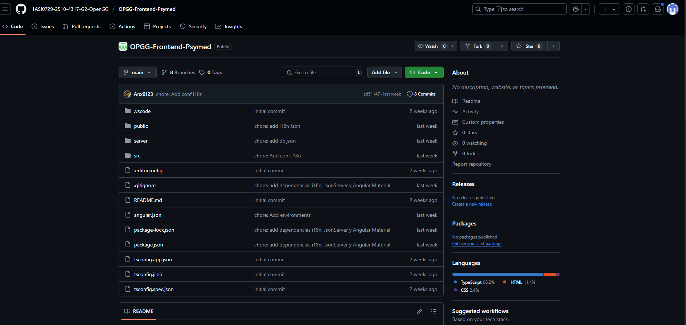

Luego, ingresamos a la sección Deploys.

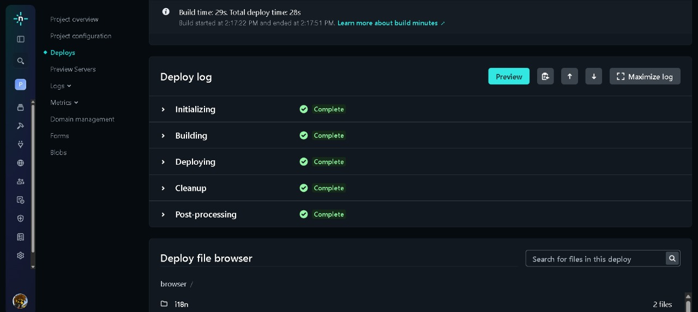

Después, En proyect configuración, llamamos a la aplicación para su visualización y se despliega.

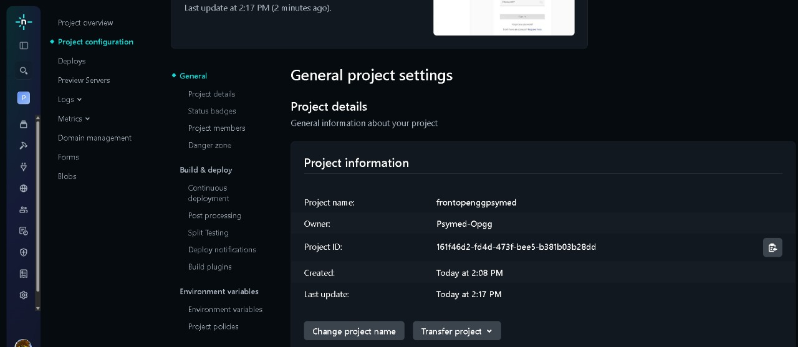

#### 5.2.2.8. Team Collaboration Insights during Sprint.

En esta parte, se mostrará la participación de los integrantes del grupo para la elaboración de este sprint 2:

Report:

Frontend:

### 5.2.3. Sprint 3

#### 5.2.3.1. Sprint Planning 3.

En este sprint nos enfocaremos en la corrección de errores detectados en el frontend y en la mejora de la usabilidad general de la aplicación. Por ello, se mostrará el resumen del sprint planning meeting 3:

<table align="center"  border="1" width="90%" style="text-align:center;">
    <tr align="left">
        <td>
            <b>Sprint 3</b>
        </td>
        <td>
            <b>Sprint 3</b>           
        </td>
    </tr>
    <tr align="left">
        <td colspan="2">
            <b>Sprint Planning Background</b>
        </td>
    </tr>
    <tr align="left">
        <td>
            <b>Date</b>
        </td>
        <td>
            04/06/25
        </td>
    </tr>
       <tr align="left">
        <td>
            <b>Time</b>
        </td>
        <td>
            10:00         
        </td>
    </tr>
       <tr align="left">
        <td>
            <b>Location</b>
        </td>
        <td>
            Modalidad Remota por Whatsapp  
        </td>
    </tr>
     </tr>
       <tr align="left">
        <td>
            <b>Prepared By</b>
        </td>
        <td>
            Aru Acevedo, Yair Christofer
        </td>
    </tr>
    </tr>
       <tr align="left">
        <td>
            <b>Attendess (to planning meeting)</b>
        </td>
        <td>
            - Chavez Uribe, Ario Joel 
            - Aru Acevedo, Yair Christofer 
            - Seminario Castillo, Diego Vicente  
            - Astuyauri Herencia, Jhomar Cristian Elias  
            - Ccotarma Ttito Sihuar, Eduardo Eusebio  
            - Prudencio Alcantara, Joel Gerson 
        </td>
    </tr>
    </tr>
       <tr align="left">
        <td>
            <b>Sprint 3</b>
            <b>Review Summary</b>
        </td>
        <td>
            Se desplegó la nueva versión del frontend con las correcciones indicadas en el proyecto permitiendo su funcionalidad completa. Además, se desplegó la Landing Page con conexión al frontend mediante un botón Call to Action.
        </td>
    </tr>
    <tr align="left">
        <td>
            <b>Sprint 3</b>
            <b>Retrospective Summary</b>
        </td>
        <td>
          Correcion de errores en el Frontend y mejoras en la usabilidad de la aplicación. Se implementaron nuevas funcionalidades como el registro de pacientes, profesionales y medicamentos, así como la visualización de estadísticas biológicas.
            Se desarrollaron endpoints para la gestión de pacientes, profesionales y medicamentos, permitiendo una interacción más fluida con la aplicación. Además, se mejoró la interfaz de usuario para facilitar la navegación y el acceso a las diferentes funcionalidades.
        </td>
    </tr>
    <tr align="left">
        <td colspan="2">
            <b>Sprint Goal & User Stories</b>
        </td>
    </tr>
    <tr align="left">
        <td>
            <b>Sprint 3 Goal</b>
        </td>
        <td>
            Para el desarrollo del sprint 3, el equipo estructuró los datos que se utilizaran en el backend para su implementación en el frontend mediante los diagramas.Para ello, se creó el repositorio donde se llevara los commits del desarrollo del backend. Además, se asignaron las tareas a corregir en el reporte.
        </td>
    </tr>
    <tr align="left">
        <td>
            <b>Sprint 3 Velocity</b>
        </td>
        <td>
            117
        </td>
    </tr>
    <tr align="left">
        <td>
            <b>Sum of Story Points</b>
        </td>
        <td>
            138
        </td>
    </tr>
</table>

#### 5.2.3.2. Aspect Leaders and Collaborators.
| Username (GitHub)             | Nombre                                   |
|-------------------------------|------------------------------------------|
| Eduardo Sihuar Ccotarma Ttito | Eduardo Sihuar Ccotarma Ttito            |
| DiegoSeminario                | Diego Vicente Seminario Castillo         |
| Yair360                       | Yair Christofer Aru Acevedo              |
| feg06                         | Ario Joel Chavez Uribe                   |
| Jhomar Cristián Elias         | Jhomar Cristián Elias Astuyauri Herencia |
| joel5871                      | Joel Prudencio Alcantara                 |

#### 5.2.3.3. Sprint Backlog 3

| **US** | **Tarea**                                     | **TID**  | **Descripción de la tarea**                      | **Detalle**                                                       | **Horas estimadas**  | **Autor**                                 | **Estado**  |
|--------|-----------------------------------------------|----------|--------------------------------------------------|-------------------------------------------------------------------|----------------------|-------------------------------------------|-------------|
| 21     | Añadir medicamentos vía API REST              | TS07     | Permitir registrar medicamentos de un paciente.  | Crear endpoint POST para agregar medicamentos y validar datos.    | 7                    | Eduardo Sihuar Ccotarma Ttito             | Done        |
| 22     | Obtener estadísticas biológicas vía API REST  | TS08     | Recuperar datos biológicos del paciente.         | Implementar endpoint GET para devolver estadísticas biológicas.   | 5                    | Diego Vicente Seminario Castillo          | Done        |
| 23     | Obtener estado de ánimo vía API REST          | TS09     | Consultar estados de ánimo del paciente.         | Crear endpoint GET para listar registros de estado de ánimo.      | 6                    | Yair Christofer Aru Acevedo               | Done        |
| 24     | Obtener consumo de medicamentos vía API REST  | TS10     | Consultar consumo de medicamentos.               | Endpoint GET para listar medicamentos consumidos y su frecuencia. | 4                    | Ario Joel Chavez Uribe                    | Done        |
| 25     | Actualizar apuntes terapéuticos vía API REST  | TS12     | Modificar apuntes de sesión terapéutica.         | Endpoint PUT/PATCH para editar notas de la sesión.                | 8                    | Jhomar Cristián Elias Astuyauri Herencia  | Done        |
| 26     | Añadir apuntes terapéuticos vía API REST      | TS13     | Registrar nuevos apuntes de sesión.              | Endpoint POST para guardar nuevas notas de la sesión.             | 5                    | Joel Prudencio Alcantara                  | Done        |
| 27     | Obtener recordatorios vía API REST            | TS16     | Consultar recordatorios de actividades.          | Endpoint GET para listar próximos recordatorios del paciente.     | 6                    | Eduardo Sihuar Ccotarma Ttito             | Done        |
| 28     | Notificaciones de cambios vía API REST        | TS18     | Recibir notificaciones de cambios del terapeuta. | Endpoint GET para obtener notificaciones recientes.               | 4                    | Diego Vicente Seminario Castillo          | Done        |
| 29     | Confirmar consumo de pastillas vía API REST   | TS20     | Registrar confirmación de toma de pastillas.     | Endpoint POST para guardar confirmación de consumo.               | 7                    | Yair Christofer Aru Acevedo               | Done        |
| 30     | Registrar funciones biológicas vía API REST   | TS21     | Guardar datos biológicos del paciente.           | Endpoint POST para registrar funciones como sueño y apetito.      | 5                    | Ario Joel Chavez Uribe                    | Done        |
| 33     | Revisar actualizaciones de terapia            | US27     | Ver historial de cambios en la terapia.          | Implementar vista para mostrar cambios previos en el tratamiento. | 6                    | Jhomar Cristián Elias Astuyauri Herencia  | Done        |
| 34     | Notificación de nuevos mensajes               | US31     | Avisar al paciente de mensajes nuevos.           | Implementar sistema de notificaciones en frontend y backend.      | 8                    | Joel Prudencio Alcantara                  | Done        |
| 35     | Acceso a nuevas instrucciones                 | US32     | Consultar nuevas instrucciones del terapeuta.    | Vista para mostrar instrucciones recientes y cambios.             | 4                    | Eduardo Sihuar Ccotarma Ttito             | Done        |
| 40     | Actualizar información del paciente           | US17     | Editar datos personales del paciente.            | Formulario y endpoint para actualizar información básica.         | 7                    | Diego Vicente Seminario Castillo          | Done        |
| 41     | Visualizar progreso del tratamiento           | US21     | Mostrar avance del paciente en la terapia.       | Implementar dashboard con gráficos de progreso.                   | 5                    | Yair Christofer Aru Acevedo               | Done        |
| 51     | Actualizar consumo de pastillas vía API REST  | TS11     | Modificar registro de consumo de pastillas.      | Endpoint PUT/PATCH para actualizar datos de consumo.              | 6                    | Ario Joel Chavez Uribe                    | Done        |
| 52     | Actualizar diagnóstico vía API REST           | TS14     | Modificar diagnóstico del paciente.              | Endpoint PUT/PATCH para editar diagnóstico existente.             | 8                    | Jhomar Cristián Elias Astuyauri Herencia  | Done        |
| 54     | Obtener datos del dashboard vía API REST      | TS17     | Consultar datos resumidos del paciente.          | Endpoint GET para devolver información del dashboard.             | 7                    | Joel Prudencio Alcantara                  | Done        |
| 55     | Registrar estado de ánimo vía API REST        | TS19     | Guardar nuevo registro de estado de ánimo.       | Endpoint POST para añadir estado de ánimo del paciente.           | 4                    | Eduardo Sihuar Ccotarma Ttito             | Done        |
| 56     | Actualizar acceso del paciente vía API REST   | TS22     | Modificar credenciales del paciente.             | Endpoint PUT/PATCH para actualizar email y contraseña.            | 5                    | Diego Vicente Seminario Castillo          | Done        |
| 57     | Actualizar datos del profesional vía API REST | TS23     | Modificar información del profesional.           | Endpoint PUT/PATCH para actualizar datos personales y contacto.   | 6                    | Yair Christofer Aru Acevedo               | Done        |
| 58     | Añadir paciente vía API REST                  | TS01     | Registrar nuevo paciente en el sistema.          | Endpoint POST para crear paciente y validar datos.                | 8                    | Ario Joel Chavez Uribe                    | Done        |
| 59     | Añadir profesional vía API REST               | TS02     | Registrar nuevo profesional de salud mental.     | Endpoint POST para crear profesional y validar datos.             | 7                    | Jhomar Cristián Elias Astuyauri Herencia  | Done        |

#### 5.2.3.4. Development Evidence for Sprint Review.

En esta sección se explica y presenta los avances en implementación con relación a los productos de la solución según el alcance del Sprint 3

| **Repository** | **Branch** | **Commit ID** | **Author** | **Time ago** |
|----------------|------------|---------------|------------|--------------|
| PSYMED         | feature/patient | e5f8bc8403ae120b48ebe7d188245f694c000f00 | yair  | 1 days ago  |
| PSYMED         | develop | 205f39de9311c007e3d4527f1670324c99bb1ce7  | sihuar  |  1 days ago |
| PSYMED         | feature/medic-schedules-and-sections| 275d4f0af5607bde39b08fd0db37cbd2b19b5f72 | ario | 1 days ago |
| PSYMED         | document_Swagger | f18cb97018d1e30d9402123ef414dabc6002d3c3 | sihuar  |  1 days ago |

#### 5.2.3.5. Execution Evidence for Sprint Review.

En el sprint 3 se logró un avance en la implementación y despliegue 
del back-end. Se desarrollaron varias secciones clave donde el usuario 
puede guardar y registrar sus datos. A continuación, se presentan algunas evidencias:

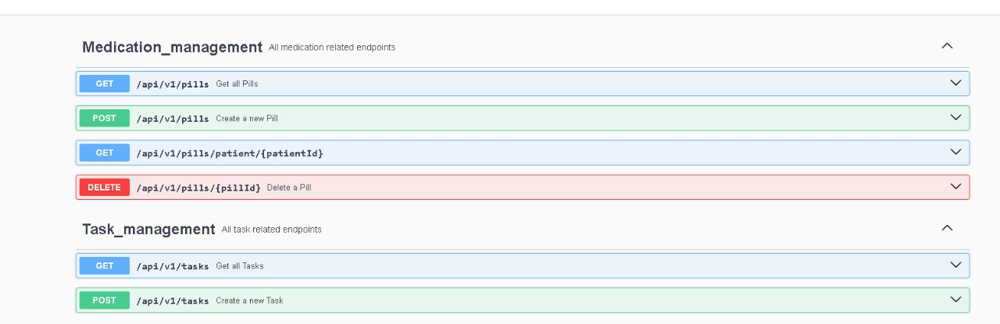
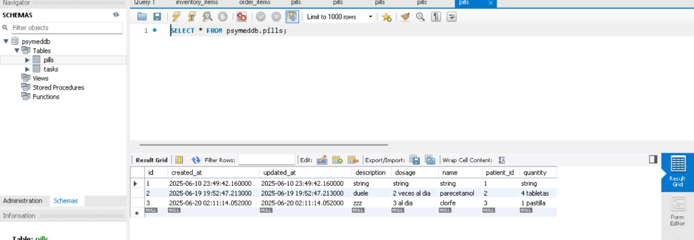

#### 5.2.3.6. Services Documentation Evidence for Sprint Review.

Durante el Sprint 3, el enfoque principal se centró en la corrección de errores en el frontend y en la implementación del backend de la aplicación. En este ciclo se desarrollaron:

*Nuevas funcionalidades para el registro y gestión de pacientes, profesionales de salud mental y medicamentos.

*Endpoints backend para permitir la interacción con los datos de pacientes, profesionales y medicamentos.

*Mejoras en la interfaz de usuario para optimizar la usabilidad y facilitar la navegación.

#### 5.2.3.7. Software Deployment Evidence for Sprint Review.
Durante el Sprint 3, se logró desplegar exitosamente el Backend de PsyMed, integrándolo con el Frontend ya existente. Esto permitió que la plataforma funcione de manera completa, facilitando la gestión de pacientes, profesionales y medicamentos. Además, se mejoró la estabilidad y el rendimiento del sistema para ofrecer una mejor experiencia a los usuarios.

#### 5.2.3.8. Team Collaboration Insights during Sprint.

En esta parte, se mostrará la participación de los integrantes del grupo para la elaboración de este sprint 3:

Report:
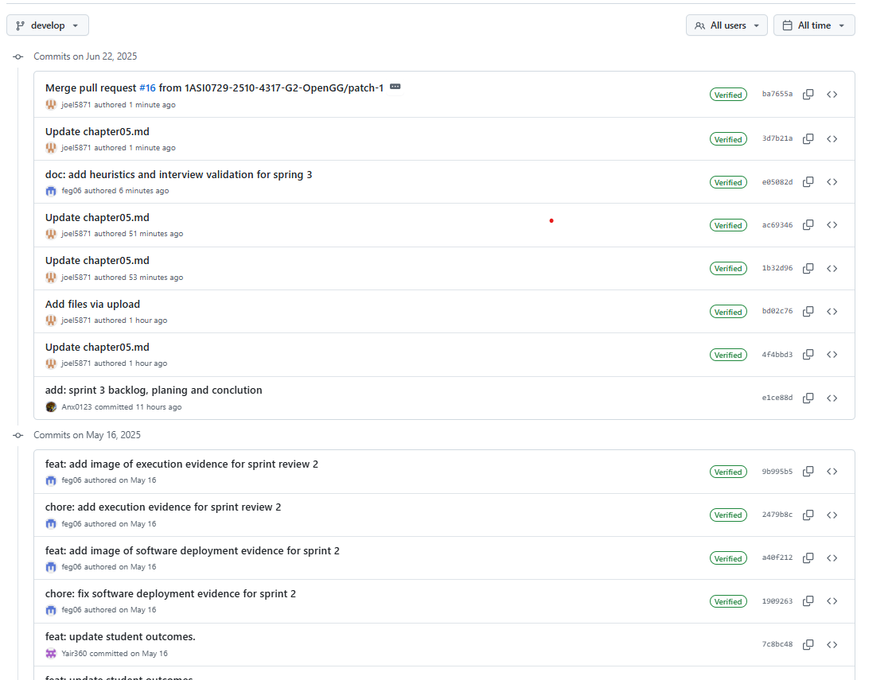

Backend:
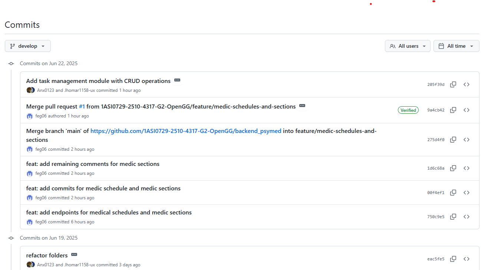

### 5.2.4. Sprint 4
#### 5.2.4.1. Sprint Planning 4

Para el sprint 4, el equipo realizó el sprint planning meeting para la distribución de tareas y revisión de errores a corregir. El resumen se mostrará a continuación:

<table align="center"  border="1" width="90%" style="text-align:center;">
    <tr align="left">
        <td>
            <b>Sprint 4</b>
        </td>
        <td>
            <b>Sprint 4</b>           
        </td>
    </tr>
    <tr align="left">
        <td colspan="2">
            <b>Sprint Planning Background</b>
        </td>
    </tr>
    <tr align="left">
        <td>
            <b>Date</b>
        </td>
        <td>
            30/06/25
        </td>
    </tr>
       <tr align="left">
        <td>
            <b>Time</b>
        </td>
        <td>
            9:00 PM         
        </td>
    </tr>
       <tr align="left">
        <td>
            <b>Location</b>
        </td>
        <td>
            Modalidad Remota por Discord  
        </td>
    </tr>
     </tr>
       <tr align="left">
        <td>
            <b>Prepared By</b>
        </td>
        <td>
            Aru Acevedo, Yair Christofer
        </td>
    </tr>
    </tr>
       <tr align="left">
        <td>
            <b>Attendess (to planning meeting)</b>
        </td>
        <td>
            - Chavez Uribe, Ario Joel 
            - Aru Acevedo, Yair Christofer 
            - Seminario Castillo, Diego Vicente  
            - Astuyauri Herencia, Jhomar Cristian Elias  
            - Ccotarma Ttito Sihuar, Eduardo Eusebio  
            - Prudencio Alcantara, Joel Gerson 
        </td>
    </tr>
    </tr>
       <tr align="left">
        <td>
            <b>Sprint n - 4</b>
            <b>Review Summary</b>
        </td>
        <td>
            Se creó la primera versión del backend y se corrigió la mayoria de errores en el reporte. Además, se implementó el diseño final del frontend.
        </td>
    </tr>
    <tr align="left">
        <td>
            <b>Sprint n - 4</b>
            <b>Retrospective Summary</b>
        </td>
        <td>
            Según los miembros del equipo, se logró corregir la mayoria del reporte, frontend y se implementó un backend sólido en la estructura para el consumo de API por parte del frontend.
        </td>
    </tr>
    <tr align="left">
        <td colspan="2">
            <b>Sprint Goal & User Stories</b>
        </td>
    </tr>
    <tr align="left">
        <td>
            <b>Sprint 4 Goal</b>
        </td>
        <td>
            Para el desarrollo del sprint 4, el equipo publicara la ultima version del frontend y backend corrigiendo las errores indicados además de añadir las secciones faltantes en el reporte. Además de realizar la conexión entre ambos apartados.
        </td>
    </tr>
    <tr align="left">
        <td>
            <b>Sprint 4 Velocity</b>
        </td>
        <td>
            61
        </td>
    </tr>
       <tr align="left">
        <td>
            <b>Sum of Story Points</b>
        </td>
        <td>
            61
        </td>
    </tr>
</table>

#### 5.2.4.2. Aspect Leaders and Collaborators.
| Username (GitHub) | Nombre                                   |
|-------------------|------------------------------------------|
| Anx0123           | Eduardo Sihuar Ccotarma Ttito            |
| DiegoSeminario    | Diego Vicente Seminario Castillo         |
| Yair360           | Yair Christofer Aru Acevedo              |
| feg06             | Ario Joel Chavez Uribe                   |
| Jhomar1158-ux     | Jhomar Cristián Elias Astuyauri Herencia |
| joel5871          | Joel Prudencio Alcantara                 |

#### 5.2.4.3. Sprint Backlog 4

| TU   | Tarea                                       | TID   | Descripción de la tarea                         | Detalle                                                               | Horas estimadas | Autor                                    | Estado      |
|------|---------------------------------------------|-------|-------------------------------------------------|-----------------------------------------------------------------------|-----------------|------------------------------------------|-------------|
| TU18 | Añadir paciente vía API REST                | TS01A | Crear endpoint POST para pacientes              | Implementar lógica de registro, validación y respuesta.               | 5               | Yair Christofer Aru Acevedo              | Done        |
|      |                                             | TS01B | Manejo de errores y validación duplicados       | Validar información repetida y retornar status 400 con mensaje claro. | 3               | Yair Christofer Aru Acevedo              | Done        |
| TU19 | Añadir profesional vía API REST             | TS02A | Crear endpoint POST para profesionales          | Registrar profesionales con especialidad y validaciones.              | 5               | Diego Vicente Seminario Castillo         | Done        |
|      |                                             | TS02B | Validar datos y manejar errores                 | Verificar la información duplicada y campos requeridos                | 3               | Diego Vicente Seminario Castillo         | Done        |
| TU20 | Implementar inicio de sesión vía API        | TS05A | Crear endpoint POST /login                      | Validar credenciales y generar token JWT                              | 4               | Eduardo Sihuar Ccotarma Ttito            | Done        |
|      |                                             | TS05B | Gestión de errores por credenciales incorrectas | Retornar 401 con mensaje si usuario/clave no coinciden                | 2               | Eduardo Sihuar Ccotarma Ttito            | Done        |
| TU21 | Añadir medicamentos vía API REST            | TS07A | Crear endpoint POST para medicamentos           | Registrar medicamentos con campos válidos y estructura correcta       | 5               | Eduardo Sihuar Ccotarma Ttito            | Done        |
|      |                                             | TS07B | Validar campos y retorno de errores             | Manejo de errores por datos faltantes o inválidos                     | 2               | Eduardo Sihuar Ccotarma Ttito            | Done        |
| TU22 | Añadir apuntes de sesión terapéutica        | TS13  | Registrar apuntes en una sesión existente       | Crear endpoint POST para apuntes asociados a una sesión               | 5               | Ario Joel Chavez Uribe                   | In Progress |
| TU23 | Crear diagnóstico clínico del paciente      | TS15  | Crear diagnóstico inicial de un paciente        | Crear endpoint POST con validaciones de campos requeridos             | 6               | Ario Joel Chavez Uribe                   | To Do       |
| TU24 | Registrar nueva sesión terapéutica          | TS24A | Crear endpoint POST para sesiones               | Registrar sesión con ID de paciente y profesional                     | 4               | Jhomar Cristián Elias Astuyauri Herencia | In Progress |
|      |                                             | TS24B | Validación de datos y manejo de errores         | Validar campos y retornar respuesta 201 o error según caso            | 2               | Jhomar Cristián Elias Astuyauri Herencia | In Progress |
| TU25 | Obtener sesión terapéutica existente        | TS25  | Recuperar detalles de una sesión registrada     | Crear endpoint GET con estructura y validación por ID                 | 4               | Jhomar Cristián Elias Astuyauri Herencia | Done        |

#### 5.2.4.4. Development Evidence for Sprint Review

| **Repository**  | **Branch**                           | **Commit ID**                            | **Author**      | **Time ago** |
|-----------------|--------------------------------------|------------------------------------------|-----------------|--------------|
| backend_psymed  | develop                              | e5f8bc8403ae120b48ebe7d188245f694c000f00 | Anx0123         | 1 days ago   |
| backend_psymed  | feature/IAM                          | e5f8bc8403ae120b48ebe7d188245f694c000f00 | Anx0123         | 1 days ago   |
| backend_psymed  | feature/profiles                     | 205f39de9311c007e3d4527f1670324c99bb1ce7 | Yair360         | 1 days ago   |
| backend_psymed  | feature/patient                      | 205f39de9311c007e3d4527f1670324c99bb1ce7 | Yair360         | 14 days ago  |
| backend_psymed  | feature/medic-and-patient            | 205f39de9311c007e3d4527f1670324c99bb1ce7 | DiegoSeminario  | 1 days ago   |
| backend_psymed  | feature/medic-schedules-and-sections | 275d4f0af5607bde39b08fd0db37cbd2b19b5f72 | feg06           | 6 days ago   |
| backend_psymed  | feature/document_Swagger             | f18cb97018d1e30d9402123ef414dabc6002d3c3 | Jhomar1158-ux   | 1 days ago   |

#### 5.2.4.5. Execution Evidence for Sprint Review

El despliegue se realizó exitosamente y se puede visualizar su funcionamiento. Este se encuentra en el siguiente enlace: https://backendpsymed-production.up.railway.app/

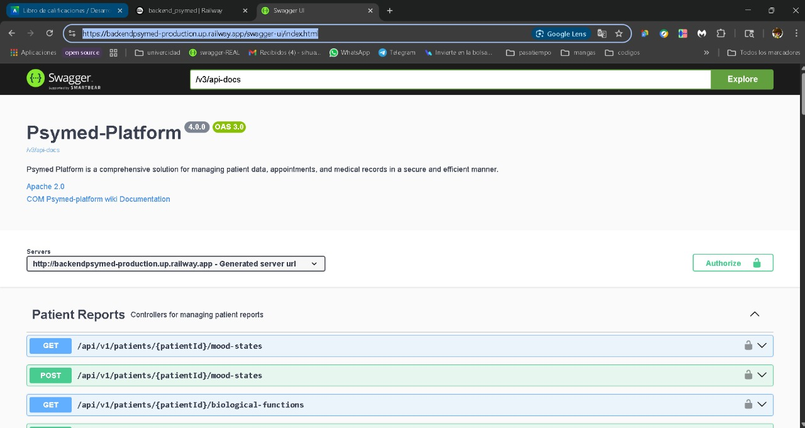

#### 5.2.4.6. Services Documentation Evidence for Sprint Review

Para el uso de datos en el frontend se utiliza la API del backend desarrollado y desplegado.

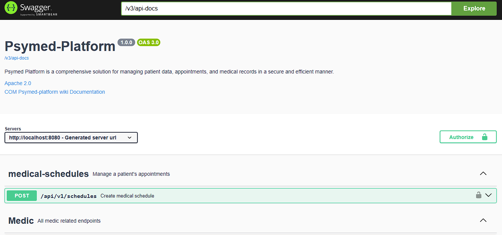

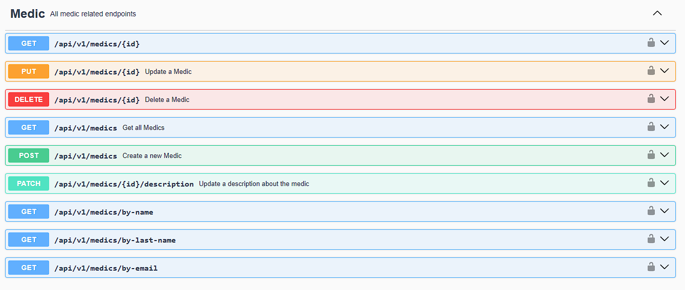

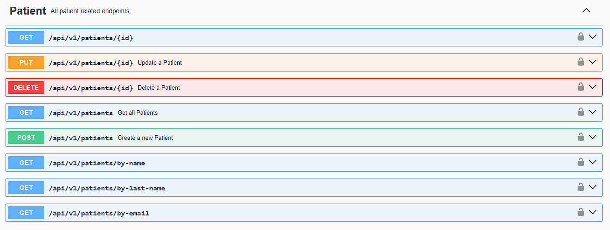

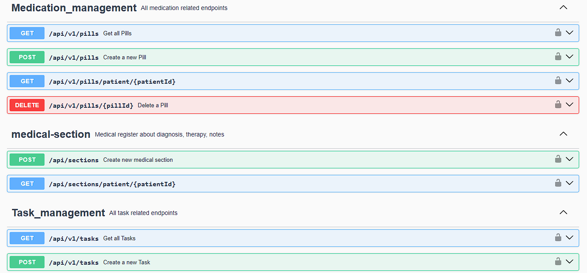

#### 5.2.4.7. Software Deployment Evidence for Sprint Review

Para el despliegue del backend se realizaron los siguientes pasos:

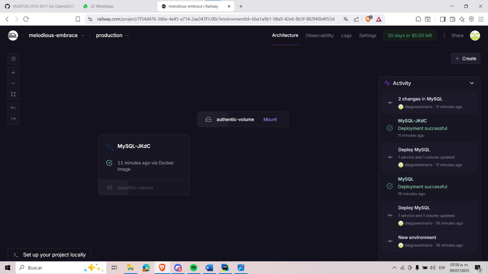

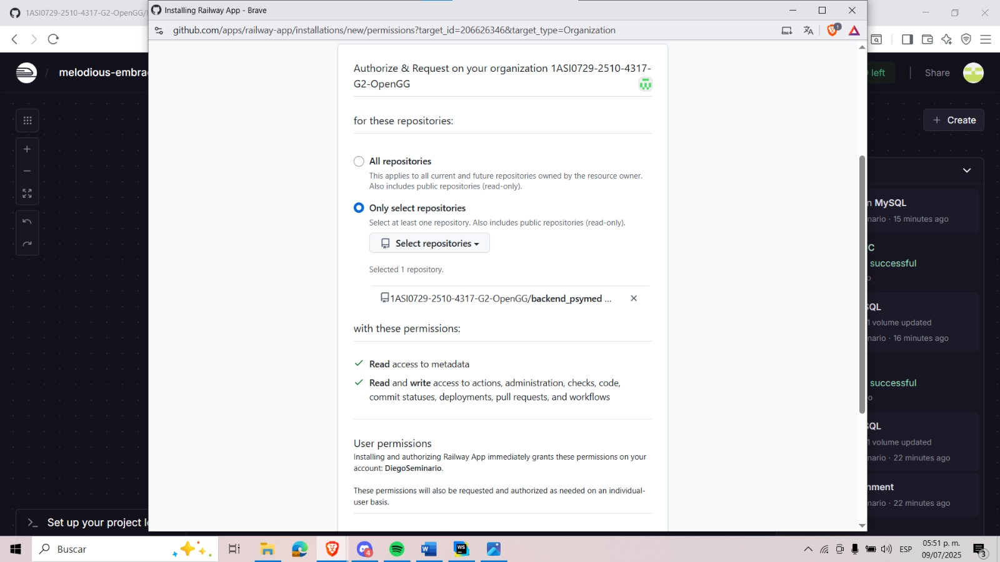

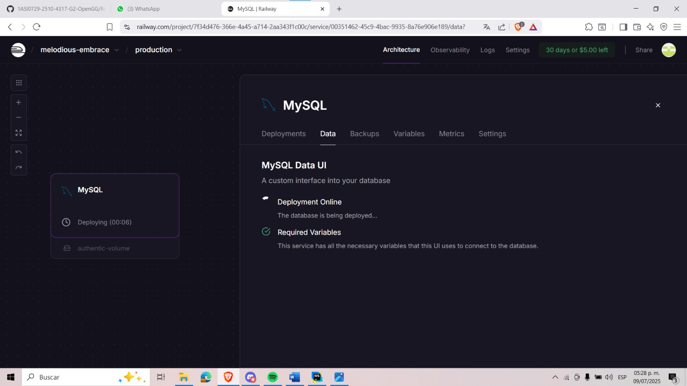

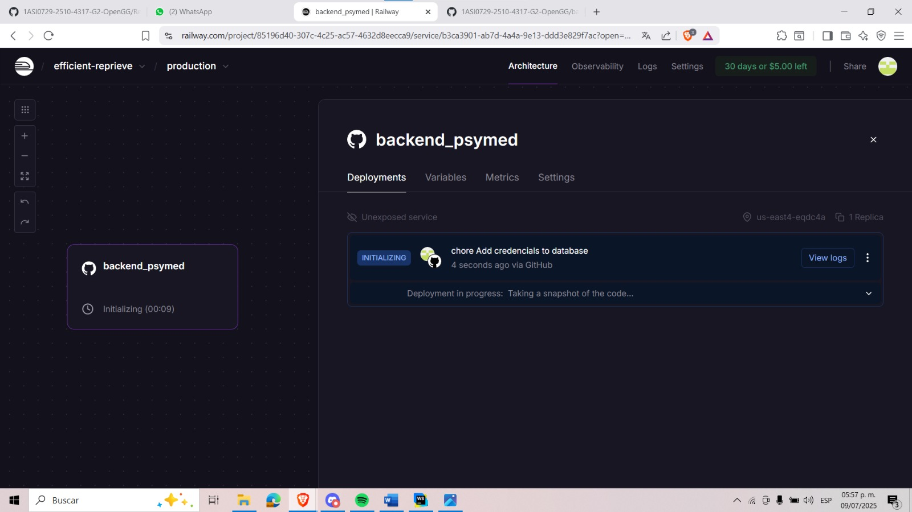

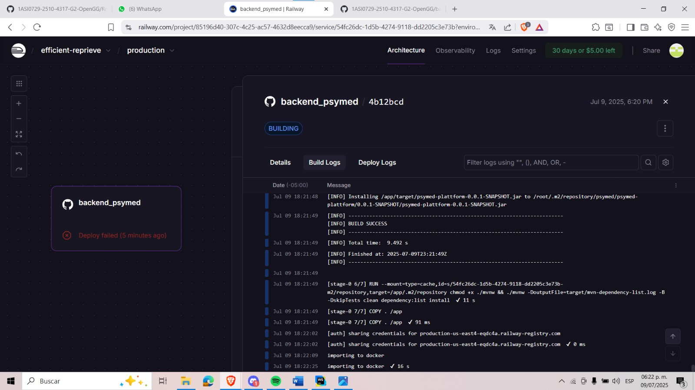

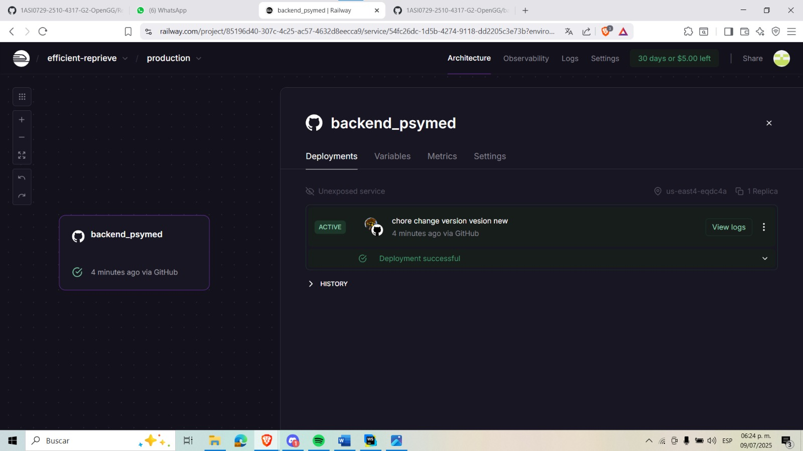

#### 5.2.4.8. Team Collaboration Insights during Sprint

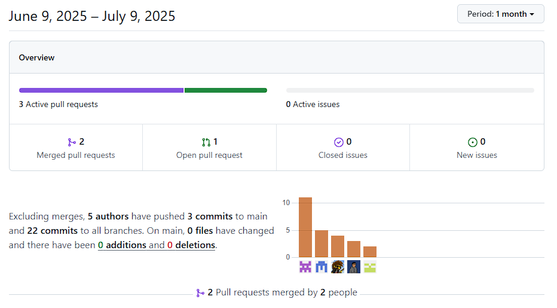

#### 5.3. Validation Interviews.

#### 5.3.1. Diseño de Entrevistas.

Para validar la aplicación y recopilar feedback de los usuarios, se diseñaron entrevistas estructuradas para profesionales de la salud mental y pacientes. Estas entrevistas se centraron en aspectos clave de la aplicación, como la usabilidad, funcionalidades más utilizadas, dificultades encontradas, sugerencias de mejora y percepción de la seguridad de la información. A continuación, se presentan las preguntas diseñadas para cada grupo de usuarios:

#### Preguntas para Profesionales de la Salud Mental

#### Preguntas Objetivas:

- ¿Qué funcionalidades usas más en la aplicación? ¿Cuáles usas menos o te resultan innecesarias?
- ¿Hay alguna funcionalidad que hayas intentado usar pero encontraste difícil o confusa?
- ¿Te resulta fácil acceder y gestionar la información de tus pacientes desde la app? Si no, ¿qué aspecto mejorarías?
- ¿Cuánto tiempo promedio te toma completar una consulta o registro dentro de la app? ¿Crees que puede reducirse?
- ¿Consideras que el sistema de seguridad y privacidad de la app cumple con tus necesidades? ¿Qué mejorarías en este aspecto?

#### Preguntas Subjetivas:

- ¿Qué añadirías o mejorarías en el sistema de seguimiento y gestión de pacientes?
- ¿Qué tan intuitivo es el flujo de trabajo en la app? ¿Qué aspectos consideras que podrían simplificarse?
- ¿Hay alguna funcionalidad adicional que creas importante para facilitar tu labor con los pacientes?
- ¿Qué tan útil sería para ti un sistema de recordatorios o notificaciones automáticas? ¿Qué tipo de recordatorios preferirías recibir?
- ¿Qué cambiarías en la interfaz de usuario para hacer la experiencia más agradable o eficiente?

#### Preguntas para Pacientes

#### Preguntas Objetivas:

- ¿Qué sección de la app usas más (ejemplo: citas, mensajes, notas de sesión)?
- ¿Cuán fácil te resulta acceder a la información que necesitas, como horarios de citas o notas de las sesiones?
- ¿Consideras que la aplicación facilita tus interacciones con el profesional? Si no, ¿qué mejorarías?
- ¿Has experimentado dificultades técnicas al usar la app? Si es así, ¿cuáles?
- ¿Sientes que tu información personal está segura en la aplicación? ¿Qué te haría sentir aún más seguro?

#### Preguntas Subjetivas:

- ¿Qué funciones te gustaría agregar a la app para mejorar tu experiencia?
- ¿Te gustaría recibir notificaciones para recordarte citas o tareas asignadas en sesión? ¿De qué tipo?
- ¿Qué tan intuitiva y fácil de usar te parece la interfaz? ¿Qué parte cambiarías para mejorarla?
- ¿Cómo te gustaría que evolucionara la app para mejorar la comunicación con tu profesional?
- ¿Qué aspecto de la app consideras que más contribuye a tu comodidad o progreso en las sesiones? ¿Cómo podría potenciarse aún más?

### 5.3.2. Registro de Entrevistas

#### Profesionales de la salud mental

##### Entrevista 1:
Link de la entrevista: [Entrevista_Profesional](https://upcedupe-my.sharepoint.com/:v:/g/personal/u202213468_upc_edu_pe/ERGp0Ai5ZMRFlpUcfrWwCGYB1EeXNHUAg2ImyzBqh9L8Mw?nav=eyJyZWZlcnJhbEluZm8iOnsicmVmZXJyYWxBcHAiOiJPbmVEcml2ZUZvckJ1c2luZXNzIiwicmVmZXJyYWxBcHBQbGF0Zm9ybSI6IldlYiIsInJlZmVycmFsTW9kZSI6InZpZXciLCJyZWZlcnJhbFZpZXciOiJNeUZpbGVzTGlua0NvcHkifX0&e=QjrgIO)  

- **Entrevistada:** Sara Silva  
- **Inicio de la entrevista (preguntas):** 00:00:23

#### Resumen:

Sara Silva comentó que las funcionalidades que más utiliza en la aplicación son las pestañas de pacientes, historias clínicas y citas, ya que le permiten visualizar fácilmente los registros y las citas pendientes, lo cual considera muy útil. Por otro lado, mencionó que la pestaña de configuración es la que menos usa, ya que solo se requiere al inicio y no resulta tan necesaria durante el uso continuo.

No ha tenido dificultades para utilizar el sistema; al contrario, considera que es interactivo, visualmente claro y fácil de navegar. Respecto al acceso y gestión de la información, señaló que el proceso es sencillo, pero sugiere la incorporación de plantillas de llenado para facilitar y agilizar el registro de datos. Indicó que completar una consulta puede tomarle entre 15 y 20 minutos, tiempo que podría reducirse si se implementaran dichas plantillas.

En cuanto a la seguridad y privacidad, observó que no ha visto un apartado específico en la aplicación para proteger los datos sensibles. Por ello, propone agregar algún tipo de código de ingreso vinculado a cada paciente, con el fin de evitar accesos no autorizados en caso de que otro usuario acceda al dispositivo con la sesión abierta.

Sara también valoró el flujo de trabajo en la aplicación, describiéndolo como intuitivo. Como funcionalidad adicional, recomendó implementar un sistema de notificaciones que le recuerde sus citas pendientes, lo cual facilitaría su organización. Finalmente, sugirió mejorar la interfaz visual agregando más color, con el objetivo de hacer la experiencia más atractiva.

##### Entrevista 2:
Link de la entrevista: [Entrevista_Profesional]()  

#### Pacientes

##### Entrevista 1:
Link de la entrevista: [Entrevista_Pacientes](https://upcedupe-my.sharepoint.com/:v:/g/personal/u202213468_upc_edu_pe/Eb4wtMKTMwNGqp0YBA73q34BD8nYz-5JtB67Bfxid3Kpjg?nav=eyJyZWZlcnJhbEluZm8iOnsicmVmZXJyYWxBcHAiOiJPbmVEcml2ZUZvckJ1c2luZXNzIiwicmVmZXJyYWxBcHBQbGF0Zm9ybSI6IldlYiIsInJlZmVycmFsTW9kZSI6InZpZXciLCJyZWZlcnJhbFZpZXciOiJNeUZpbGVzTGlua0NvcHkifX0&e=wjy7fH)  

- **Entrevistado:** Luigi Paccini Sánchez  
- **Inicio de la entrevista (preguntas):**  00:00:13

#### Resumen:

El entrevistado comentó que la sección que más utiliza en la aplicación es la de gestión de citas, ya que le permite agendar desde casa sin tener que desplazarse al consultorio. Considera que acceder a la información es sencillo, gracias a su perfil personalizado, donde puede consultar fácilmente los horarios y datos relacionados a sus sesiones.

Mencionó que la aplicación facilita mucho su interacción con el profesional de salud mental, ya que recibe respuestas rápidas a sus mensajes, lo que resuelve sus dudas de forma eficiente. No ha experimentado dificultades técnicas con la aplicación, y los únicos inconvenientes que ha enfrentado han estado relacionados con factores externos.

En cuanto a la seguridad, mencionó que siente que su información está protegida, pero cree que se podría mejorar aún más con métodos de autenticación adicionales, similares a los que usan otras plataformas como Facebook. En cuanto a posibles mejoras, sugiere implementar un sistema que incentive o facilite respuestas más rápidas por parte de los profesionales.

También le gustaría recibir notificaciones llamativas, similares a las de aplicaciones como Duolingo, para recordar citas o tareas, ya que podrían ser útiles para personas ocupadas o con menor atención en sus responsabilidades. Respecto a la evolución de la plataforma, propuso mejorar el aspecto visual de la aplicación, haciéndola más atractiva estéticamente.

Finalmente, señaló que una funcionalidad que contribuiría aún más a su progreso sería contar con un registro completo de sus actividades o sesiones dentro de la app. En general, considera que la aplicación funciona bastante bien y cumple su propósito principal.

##### Entrevista 2:
Link de la entrevista: [Entrevista_Pacientes](https://upcedupe-my.sharepoint.com/:v:/g/personal/u202213468_upc_edu_pe/EXSyDfx3CORGlz7GzpKo5XUBjjrPFpya48laDxJ9MXR0NQ?nav=eyJyZWZlcnJhbEluZm8iOnsicmVmZXJyYWxBcHAiOiJPbmVEcml2ZUZvckJ1c2luZXNzIiwicmVmZXJyYWxBcHBQbGF0Zm9ybSI6IldlYiIsInJlZmVycmFsTW9kZSI6InZpZXciLCJyZWZlcnJhbFZpZXciOiJNeUZpbGVzTGlua0NvcHkifX0&e=eLtFGQ)  

- **Entrevistado:** Uriel Ortiz  
- **Inicio de la entrevista (preguntas):** 00:00:15

#### Resumen:

Uriel Ortiz indicó que la sección de la aplicación que más utiliza es la de citas, ya que frecuentemente revisa si hay cambios en los horarios o realiza modificaciones que desea confirmar. Considera que acceder a la información es sencillo gracias a una interfaz clara, intuitiva y organizada visualmente por colores, lo que facilita la navegación.

Señaló que la aplicación mejora notablemente su interacción con los profesionales, ya que centraliza toda la comunicación en un solo lugar. No ha tenido problemas técnicos con la plataforma, salvo por algunas interrupciones relacionadas al internet, que reconoce como factores externos. En cuanto a la seguridad, comentó que se siente cómodo con la protección actual de datos, pero que le haría sentir aún más seguro una autenticación en dos pasos.

Uriel expresó interés en contar con un sistema de chat en tiempo real para hacer consultas pequeñas a su profesional sin abusar del recurso. También le gustaría recibir notificaciones, tanto en el celular como por correo (Gmail), como recordatorio de citas o tareas asignadas en sesión. Respecto a la interfaz, dijo que le parece lo suficientemente intuitiva y visualmente agradable, por lo que no cambiaría nada por el momento.

Para futuras mejoras, propuso incluir una opción de videollamadas bajo solicitud como un posible paso adicional en la comunicación con su profesional. Finalmente, destacó que la gestión de citas, los recordatorios automáticos y la posibilidad de reprogramar fácilmente son las funcionalidades que más aportan a su comodidad y progreso dentro del proceso terapéutico.

---

### 5.3.3. Evaluaciones según heurísticas

Evaluación de la aplicación de salud mental utilizando heurísticas de usabilidad de Jakob Nielsen. Para cada heurística se incluyen observaciones específicas y sugerencias de mejora.

---

**1. Visibilidad del estado del sistema**

- **Descripción:** La aplicación debe mantener al usuario informado sobre el estado de cada acción realizada.  
- **Observaciones:** La aplicación muestra un indicador de carga al guardar registros de pacientes, pero no siempre se muestra al agendar citas.  
- **Sugerencias de mejora:** Añadir indicadores de progreso en todos los procesos, especialmente al agendar y guardar información.

---

**2. Facilidad y practicidad**

- **Descripción:** Los profesionales pueden filtrar características de pacientes.  
- **Observaciones:** Algunos botones de navegación no están ubicados en la aplicación.  
- **Sugerencias de mejora:** Añadir y alinear con el diseño de la aplicación manteniendo su practicidad.

---

**3. Flexibilidad y eficiencia de uso**

- **Descripción:** La app debe permitir accesos rápidos y opciones para usuarios expertos.  
- **Observaciones:** No hay atajos de teclado ni plantillas para notas.  
- **Sugerencias de mejora:** Agregar atajos y plantillas predefinidas para mejorar el flujo.

---

**4. Estética y diseño minimalista**

- **Descripción:** Falta de estilos minimalistas para la aplicación.  
- **Observaciones:** La pantalla de inicio presenta pocos elementos agradables.  
- **Sugerencias de mejora:** Agregar o mejorar el diseño de la aplicación.

---

**5. Ayuda a los usuarios a reconocer, diagnosticar y recuperarse de errores**

- **Descripción:** Ofrecer mensajes claros y comprensibles cuando ocurre un error.  
- **Observaciones:** Los mensajes de error son técnicos y poco útiles.  
- **Sugerencias de mejora:** Redactar mensajes en lenguaje sencillo con posibles soluciones.

---

## 5.4. Video About-the-Product

[Video About The Product](https://upcedupe-my.sharepoint.com/:v:/g/personal/u202320052_upc_edu_pe/EfHfLCBP9CFJp-ZX2GEpPtoBCUx_KM3_WjwFesjaK5x3Xw?nav=eyJyZWZlcnJhbEluZm8iOnsicmVmZXJyYWxBcHAiOiJTdHJlYW1XZWJBcHAiLCJyZWZlcnJhbFZpZXciOiJTaGFyZURpYWxvZy1MaW5rIiwicmVmZXJyYWxBcHBQbGF0Zm9ybSI6IldlYiIsInJlZmVycmFsTW9kZSI6InZpZXcifX0%3D&e=VWAode)

# Conclusiones

**TB1:**
La primera entrega del proyecto Psymed ha permitido establecer una base sólida tanto conceptual como técnica para el desarrollo del sistema. Se logró identificar claramente la problemática y necesidades del usuario mediante entrevistas y análisis, lo que guió la creación de historias de usuario y un product backlog bien estructurado. El equipo implementó un flujo de trabajo eficiente con Gitflow y Conventional Commits, asegurando orden en el desarrollo y colaboración a través de GitHub. Además, se avanzó en el diseño visual y la funcionalidad inicial de la landing page, con una propuesta centrada en la experiencia del usuario. La documentación fue realizada cuidadosamente siguiendo el formato APA, garantizando coherencia y claridad en todo el informe. Esto proporciona una dirección clara para las próximas etapas del proyecto.

**TP1:**
En esta segunda entrega, se logró implementar una mejora continua basada en las observaciones y aprendizajes obtenidos durante la primera entrega. A partir de dichas consideraciones, se diseñó y ejecutó el Sprint 2, lo cual permitió avanzar en la creación y diseño de la primera versión del frontend. Asimismo, se completó exitosamente el deploy tanto del frontend como de la API mediante json-server, lo que permitió validar la funcionalidad y la comunicación entre los componentes sin depender de un backend completo. Este enfoque ágil contribuyó a una evolución efectiva del proyecto, manteniendo la calidad y la eficiencia en cada etapa del desarrollo.

**TB2**
En esta tercera etapa del proyecto, se avanzó significativamente en la implementación de los bounded contexts identificados, logrando una mayor claridad en las funcionalidades y los requerimientos de cada sección. Se implementaron los servicios correspondientes y se desarrolló una documentación detallada, facilitando la integración y el despliegue tanto de la API como del frontend. Además, se realizó una revisión exhaustiva de los procesos y resultados obtenidos, identificando oportunidades de mejora y ajustes necesarios para la siguiente fase del proyecto.

**TF1**
En esta ultima entrega, se completó el desarrollo del reporte corrigiendo todas las observaciones y añadiendo la información requerida. Además, se implementó y desplegó el frontend y backend logrando su funcionalidad mediante los links entregados y evidenciando lo desarrollado mediante los commits en github y los videos del producto. 

# Bibliografía
Contributors, M. o. J. T. A. B. (s.f.). Bootstrap. https://getbootstrap.com/

Conventional commits. (s.f.). Conventional Commits. https://www.conventionalcommits.org/en/v1.0.0/

Figma Community: Explore templates, plugins, and widgets published by the community. (s. f.). Figma. https://www.figma.com/community

Free Line Icons for Designers and Developers - Lineicons. (2021, 23 mayo). Lineicons. https://lineicons.com/

Pallerols, X. M. (2022, 18 noviembre). Qué es el Responsive Design y por qué tu web debería serlo. Thinking For Innovation. https://www.iebschool.com/blog/que-es-responsive-web-design-analitica-usabilidad/

Vue.js. (s.f.). The Progressive JavaScript Framework | Vue.js. https://vuejs.org/

npm: json-server. (s.f.). Npm. https://www.npmjs.com/package/json-server

Dashboard. (s.f.). Vercel. https://vercel.com/guardiandeitys-projects

# Anexos
Entevistas: [Entrevistas hechas](https://upcedupe-my.sharepoint.com/:v:/g/personal/u202213468_upc_edu_pe/Ee7CIOQMlkxJhj-bC7_g3N0Bs9_gFqaSF9CBj9IS1hkSGQ?e=1CWcrr&nav=eyJyZWZlcnJhbEluZm8iOnsicmVmZXJyYWxBcHAiOiJTdHJlYW1XZWJBcHAiLCJyZWZlcnJhbFZpZXciOiJTaGFyZURpYWxvZy1MaW5rIiwicmVmZXJyYWxBcHBQbGF0Zm9ybSI6IldlYiIsInJlZmVycmFsTW9kZSI6InZpZXcifX0%3D)

Repositorio: https://github.com/1ASI0729-2510-4317-G2-OpenGG

Landing Page: https://1asi0729-2510-4317-g2-opengg.github.io/Landing-Page/

figma: https://www.figma.com/design/Vz60AoPOo718hrLAxbAB02/Open-Source-psymed-OPGG?node-id=61-79&t=hoCqkbgGZ3OU4gT4-1

canvas ppt: https://www.canva.com/design/DAGlvhfxT8o/lS45yxlZMDVOQFJaOsvwnw/edit?utm_content=DAGlvhfxT8o&utm_campaign=designshare&utm_medium=link2&utm_source=sharebutton

Fake Api: https://json-server-psymed.vercel.app/

trello: https://trello.com/b/pDKhIadm/app-web
